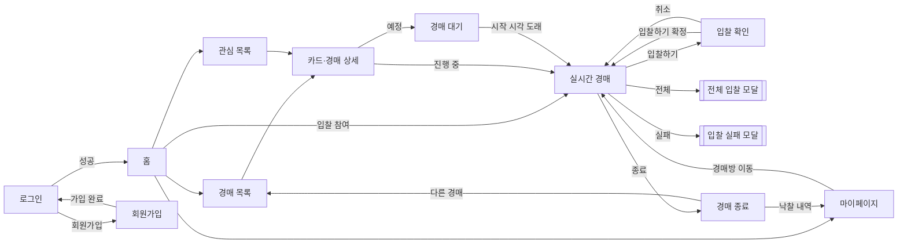
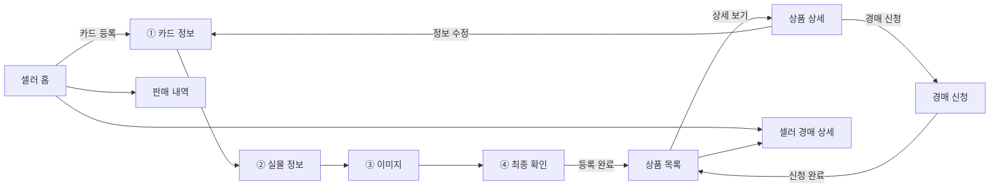
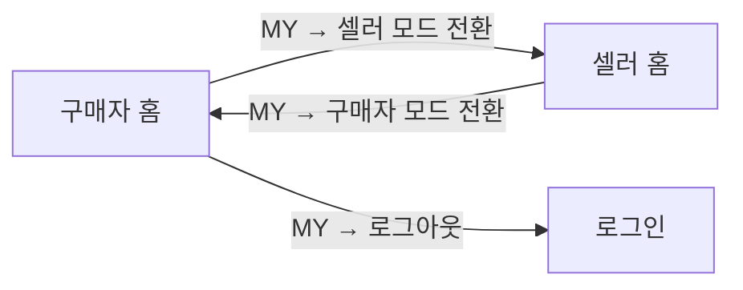

# PickUp · 디자인 가이드

> **검증된 카드, 안심 경매** — TCG(트레이딩 카드 게임) 실물 카드를 인증기관 감정 정보 기반으로 거래하는 경매 플랫폼.
> 본 문서는 와이어프레임(PC · 다크)을 기준으로 한 디자인 시스템 및 화면 명세입니다.

---

## 목차

1. [개요](#1-개요)
2. [디자인 원칙](#2-디자인-원칙)
3. [디자인 토큰](#3-디자인-토큰)
4. [레이아웃 · 내비게이션](#4-레이아웃--내비게이션)
5. [컴포넌트](#5-컴포넌트)
6. [상태 · 인터랙션 규칙](#6-상태--인터랙션-규칙)
7. [화면 명세 — 구매자](#7-화면-명세--구매자-buyer)
8. [화면 명세 — 셀러](#8-화면-명세--셀러-seller)
9. [화면 이동 플로우](#9-화면-이동-플로우)
10. [도메인 용어](#10-도메인-용어)

---

## 1. 개요

| 항목 | 내용 |
|------|------|
| 서비스명 | PickUp |
| 플랫폼 | PC 웹 (반응형은 후속 과제) |
| 테마 | 다크 모드 단일 |
| 역할 | 구매자(BUYER) · 셀러(SELLER), `MY 드롭다운`에서 역할 전환 |
| 핵심 도메인 | 인증기관(PSA·BGS·CGC) 감정 카드의 실시간 경매 |
| 결제 수단 | 가상 포인트(P) — 낙찰 시 차감, 미낙찰 시 전액 반환 |
| 플로우 색상 규칙 | **파랑 = 구매자 동선**, **청록 = 셀러 동선** |

> **자가 인증 원칙**: 서비스는 별도 검수를 제공하지 않습니다. 셀러가 인증서 일련번호를 직접 입력해 자가 인증하며, 검수·반려 상태는 존재하지 않습니다.

---

## 2. 디자인 원칙

1. **신뢰가 먼저** — 감정 등급(PSA 10 등), 인증기관, 인증서 일련번호를 카드마다 명확히 노출해 "검증된 카드"라는 정체성을 시각적으로 뒷받침한다.
2. **금액과 시간의 가독성** — 현재가·시작가·남은 시간은 화면에서 가장 눈에 띄는 정보다. 큰 크기 + `tabular-nums`로 자릿수를 정렬한다.
3. **역할별 색으로 맥락 구분** — 구매 동선은 파랑, 판매 동선은 청록. 사용자가 지금 어떤 역할인지 색으로 직관적으로 안다.
4. **비가역 액션은 반드시 한 번 더 확인** — 입찰·경매 신청 등 취소 불가 액션은 확인 단계 또는 명시적 안내 문구를 둔다.
5. **다크 우선, 저부하 화면** — 장시간 실시간 경매를 지켜보는 사용자를 위해 낮은 밝기의 배경과 절제된 강조를 사용한다.

---

## 3. 디자인 토큰

### 3.1 색상

```css
:root {
  /* 배경 · 표면 */
  --color-bg:            #0B0E14; /* 앱 최하단 배경 */
  --color-surface:       #151A23; /* 카드 · 패널 */
  --color-surface-2:     #1B2230; /* 입력 필드 · 리스트 셀 */
  --color-surface-elev:  #202838; /* 모달 · 드롭다운 */
  --color-border:        #2A3342;
  --color-border-strong: #3A4557;

  /* 텍스트 */
  --color-text:          #E7ECF3; /* 기본 */
  --color-text-sub:      #9BA6B4; /* 보조 · 라벨 */
  --color-text-muted:    #667084; /* 캡션 · 비활성 */

  /* 역할 액센트 */
  --color-buyer:         #4C82FB; /* 구매자(파랑) — 주요 CTA */
  --color-buyer-hover:   #3B6FE0;
  --color-buyer-weak:    rgba(76,130,251,0.14);
  --color-seller:        #1FD1BE; /* 셀러(청록) — 주요 CTA */
  --color-seller-hover:  #14B8A6;
  --color-seller-weak:   rgba(31,209,190,0.14);

  /* 시맨틱 */
  --color-success:       #34C759; /* 낙찰 · 정산 완료 */
  --color-warning:       #F5A623; /* 예정 · 대기 */
  --color-danger:        #FF5A5F; /* 입찰 실패 · 삭제 · 추월 */
  --color-live:          #FF3B47; /* 진행 중(LIVE) 인디케이터 도트 */

  /* 금액 강조 */
  --color-price:         #FFFFFF; /* 현재가 등 최우선 수치 */
}
```

**사용 규칙**

- 주요 CTA 색상은 **화면의 역할에 따른다**. 구매 화면 CTA = `--color-buyer`, 셀러 화면 CTA = `--color-seller`.
- `--color-danger`는 삭제/실패/추월당함 등 부정적 상태에만.
- 진행 중(LIVE)은 `--color-live` 도트 + 라벨로 표시하고, 필요 시 부드러운 점멸(펄스) 애니메이션을 준다.

### 3.2 타이포그래피

```css
--font-sans: "Pretendard", system-ui, -apple-system,
             "Apple SD Gothic Neo", "Noto Sans KR", sans-serif;
--font-num:  "Pretendard", ui-monospace, sans-serif; /* font-variant-numeric: tabular-nums */
```

| 토큰 | size / line-height / weight | 용도 |
|------|------------------------------|------|
| `display` | 32 / 40 / 700 | 페이지 대표 타이틀, 낙찰 결과 |
| `h1` | 24 / 32 / 700 | 화면 제목 |
| `h2` | 20 / 28 / 600 | 섹션 제목 |
| `h3` | 16 / 24 / 600 | 카드 제목 · 소제목 |
| `body` | 14 / 22 / 400 | 본문 |
| `body-strong` | 14 / 22 / 600 | 강조 본문 · 버튼 라벨 |
| `caption` | 12 / 18 / 400 | 라벨 · 메타 정보 · 안내 문구 |
| `price-lg` | 28 / 36 / 700 · tabular | 현재가 · 최종 낙찰가 |
| `price-md` | 18 / 24 / 700 · tabular | 리스트 카드의 현재가/시작가 |
| `timer` | 20 / 28 / 600 · tabular | 남은 시간 카운트다운 |

> 금액·타이머는 반드시 `tabular-nums`를 적용해 카운트다운 시 폭이 흔들리지 않게 한다. 금액은 3자리 콤마 구분(`1,280,000원`).

### 3.3 간격 · 반경 · 테두리

```css
/* Spacing (4px 기준) */
--space-1: 4px;  --space-2: 8px;  --space-3: 12px; --space-4: 16px;
--space-5: 20px; --space-6: 24px; --space-8: 32px; --space-10: 40px;
--space-12: 48px; --space-16: 64px;

/* Radius */
--radius-sm: 8px;    /* 배지 · 입력 필드 */
--radius-md: 12px;   /* 버튼 · 카드 */
--radius-lg: 16px;   /* 패널 · 모달 */
--radius-pill: 999px;/* 상태 배지 · 탭 pill */

/* Border · Elevation */
--border-1: 1px solid var(--color-border);
--shadow-modal: 0 16px 48px rgba(0,0,0,0.55);
--shadow-dropdown: 0 8px 24px rgba(0,0,0,0.45);

/* Container */
--container-max: 1200px;
--gnb-height: 64px;
```

---

## 4. 레이아웃 · 내비게이션

### 4.1 GNB (상단 글로벌 내비게이션)

- 높이 `--gnb-height`, 좌측 로고 **PickUp**, 우측 내비게이션.
- **로그인 전**: 로고 · `[로그인]` · `[회원가입]`.
- **로그인 후(구매자)**: `홈` · `경매` · `관심` · `MY`.
- **셀러 모드**: `PickUp 홈` · `상품` · `경매` · `MY`.
- `MY`는 클릭 시 드롭다운(마이페이지 · 역할 전환 · 로그아웃 진입) — [MY 드롭다운](#my-드롭다운) 참조.
- 현재 위치 탭은 액센트 언더라인/텍스트 강조로 표시.

### 4.2 콘텐츠 영역

- 최대 폭 `--container-max` 중앙 정렬, 좌우 여백 `--space-8` 이상.
- 리스트형 화면은 카드 그리드, 상세형 화면은 좌(이미지)–우(정보) 2단 또는 상하 구성.

---

## 5. 컴포넌트

### 5.1 버튼

| 종류 | 스타일 | 용도 |
|------|--------|------|
| Primary | 배경 = 역할 액센트, 텍스트 흰색 | 로그인, 입찰하기, 다음 단계, 경매 신청 등 주 CTA |
| Secondary | 투명 배경 + `--border-strong` | 이전, 취소, 정보 수정 |
| Ghost | 배경 없음, 텍스트만 | 상세 보기 `›`, 텍스트 링크 |
| Danger | 배경/테두리 `--color-danger` | 삭제 |
| Disabled | 배경 `--color-surface-2`, 텍스트 muted, `cursor: not-allowed` | 필수 입력 미충족 시 |

- 주 CTA는 폼/모달 하단에서 **풀-폭(full-width)** 을 기본으로 한다.
- 상태 규칙: 입력 조건을 만족하기 전까지 Primary는 **Disabled**로 유지.

### 5.2 입력 필드

- 라벨(caption, `--color-text-sub`)을 필드 위에 배치.
- 필드 배경 `--color-surface-2`, 포커스 시 역할 액센트 링(`box-shadow` 2px).
- **에러 상태**: 테두리 `--color-danger` + 하단 에러 메시지(caption).
  - 예: `아이디 또는 비밀번호를 확인해 주세요.` / `닉네임은 중복할 수 없습니다.`
- 필수 항목은 라벨 옆 `*`(danger 색)로 표기하고 하단에 `* 표시는 필수 항목입니다.` 안내.
- 검색형 필드(카드명 검색, 경매 검색)는 좌측 아이콘 + placeholder.
- `중복 확인` 등 인라인 액션 버튼은 필드 우측에 secondary 스타일로 부착.

### 5.3 경매/상품 카드

구성 요소: **썸네일 이미지 · 상태 배지 · 카드명 · 감정 등급 배지 · 가격 · 시간 정보 · 관심(하트)**.

- 상태 배지는 카드 좌상단, 하트는 우상단.
- 가격은 `price-md`, 라벨(`현재가`/`시작가`/`낙찰가`)은 caption으로 위에.
- 진행 중 = `현재가` + `남은 시간`, 예정 = `시작가` + `시작 시각`, 종료 = `낙찰가`/`유찰` + `종료됨`.

### 5.4 배지

| 배지 | 색 | 예시 |
|------|-----|------|
| 진행 중 (LIVE) | `--color-live` 도트 + 텍스트 | `● 진행 중` |
| 예정 | `--color-warning` | `예정` |
| 종료 | `--color-text-muted` | `종료` |
| 낙찰 | `--color-success` | `낙찰` |
| 감정 등급 | 중립(surface-2) + 강조 텍스트 | `PSA 10`, `BGS 9.5`, `PSA 8` |
| 상품 상태 | 맥락별 | `등록 가능`, `정산 예정`, `정산 완료`, `재신청 가능` |

### 5.5 카운트다운 타이머

- `timer` 타이포, `HH : MM : SS` 형식(`00 : 42 : 11`).
- 실시간 화면에서는 `실시간 연결됨` 상태 라벨과 함께 노출.
- 종료 임박 시 색을 `--color-danger`로 전환(선택 사항).

### 5.6 탭 · 필터

- 세그먼트형 탭(`진행 중 / 예정 / 종료`, `입찰 내역 / 낙찰 내역` 등) — 단일 선택.
- 정렬 드롭다운(`인기순`, `가격 낮은/높은순`, `종료 임박 순` 등)은 탭 우측.

### 5.7 모달

- 반투명 오버레이 + 중앙 다이얼로그(`--color-surface-elev`, `--shadow-modal`, `--radius-lg`).
- 우상단 닫기 `✕`.
- 사용처: [입찰 확인](#bid-confirmhtml), [전체 입찰 모달](#all-bids-modal), [입찰 실패 모달](#bid-fail-modal).

### 5.8 드롭다운

- `MY` 클릭 시 하단 앵커, `--shadow-dropdown`.
- 항목 그룹: 내역(입찰/낙찰) · 관심 목록 · 보유 포인트 · 계정 설정 · **셀러 모드 전환** · 로그아웃.

### 5.9 입찰 내역 리스트(실시간)

- 행 구성: **아바타(닉네임 기반 이니셜/색상) · 닉네임 · 금액 · 상대 시간**(`방금 전`, `1분 전`…). 아바타는 실제 프로필 사진이 아닌 대체 표시다.
- 본인 입찰(`나`)은 액센트 배경/굵기로 강조.
- **입찰자별 중복 제거**: 같은 입찰자가 다시 입찰하면 새 행이 추가되지 않고 기존 행이 갱신된다 — 금액이 카운트업/다운 애니메이션으로 바뀌고, 목록 맨 위로 이동한다. 새 입찰자는 아래에서 위로 슬라이드하며 나타난다.
- 개수 제한 없음. 스크롤(또는 `[더 보기]`)로 이어서 불러온다(커서 페이지네이션). 입찰 이벤트 수신 시 목록을 최신화한다.
- `[전체]`로 열리는 모달은 중복 제거 없이 **모든 입찰**을 최근 순으로 보여준다(§`BidList`).

### 5.10 스텝 인디케이터

- 카드 등록 4단계(`카드 정보 → 실물 정보 → 이미지 → 최종 확인`)에 사용.
- 현재 단계 액센트, 완료 단계 체크, 이후 단계 muted.

---

## 6. 상태 · 인터랙션 규칙

- **버튼 활성 조건**: 필수 입력이 모두 충족되어야 Primary 활성화. (로그인: 아이디·비밀번호 입력 / 카드 등록 3단계: 앞·뒷면 이미지 필수)
- **입찰 검증**: 입찰가는 `현재가 + 최소 입찰 단위` **이상**이어야 하며 미만은 거절 → 입찰 실패 모달.
- **최소 입찰 단위**: 시작가의 **5%**, 시스템이 결정(셀러가 지정 불가).
- **희망 시작가 하한**: **1,000원 이상**. 미만이면 경매 신청 불가(최소 입찰 단위가 원 단위로 의미를 갖는 하한).
- **비가역 안내**: 입찰(`입찰은 취소할 수 없습니다.`), 경매 신청(`신청 후 수정·삭제 불가`)은 실행 전 명시.
- **자동 전환**: `경매 대기` 화면은 시작 시각 도래 시 자동으로 `실시간 경매`로 전환.
- **추월 알림**: 다른 사용자가 더 높은 금액을 입찰하면 실시간 화면에 `추월당했습니다` 알림.
- **포인트 처리**: 낙찰 시 낙찰가만큼 차감, 미낙찰 시 전액 반환 — 경매 종료 화면에 결과 표기.
- **닉네임 표시**: 타 사용자 닉네임은 그대로 표시하고, 본인은 `나`로 표기.
- **삭제 제약**: 경매 시작 이후 상태의 상품은 삭제 불가.

---

## 7. 화면 명세 — 구매자 (BUYER)

### login.html · 메인 · 로그인(로그인 전)
- 로그인 여부와 무관하게 볼 수 있는 진입 화면. GNB에 로고 · `[로그인]` · `[회원가입]`.
- 아이디·비밀번호 모두 입력되어야 `[로그인]` 활성화. 형식 검증은 회원가입에서만 한다 — 정책 변경 전에 만든 계정도 로그인할 수 있어야 한다.
- 성공 시 홈으로 이동, 실패 시 `아이디 또는 비밀번호를 확인해 주세요.` 표시.
- `[회원가입]` → 회원가입 화면.

### register.html · 회원가입
- 아이디·닉네임·비밀번호 입력, 닉네임 `중복 확인` 제공. 입력 규칙은 아래와 같다(네이버 가입 정책 기준).
  - 아이디: 영문 소문자로 시작하는 **5~15자** (영문 소문자·숫자·`_`·`-`)
  - 비밀번호: 영문·숫자·특수문자 중 **2가지 이상 조합 8~16자** (공백 불가)
  - 닉네임: **2~8자**
- 생성 시 아이디·닉네임 중복이면 가입 불가 (`닉네임은 중복할 수 없습니다.`).
- `[가입하기]` 성공 시 로그인 화면으로 이동.

### home.html · 메인 화면(홈)
- 대표 경매 1건을 크게 노출, 없으면 예정 경매를 대표로 표시.
- 노출 순서: **관심 수 많은 순 → 시작 임박 순 · 상태 대기**.
- 진행 중 최대 **3건** / 곧 시작 최대 **4건**, 하트로 관심 등록.
- `[입찰 참여]` → 실시간 경매, 카드 클릭 → 상세, 상단 탭 → 목록/관심/마이페이지.

### auction list.html · 경매 목록
- 검색(카드셋 · 카드명 · 언어)으로 경매 탐색.
- 정렬: 인기 · 가격 ↑↓ / 진행 중 = 종료 임박 / 예정 = 시작 임박 / 종료 = 종료 시점.
- `진행 중 · 예정 · 종료` 단일 필터, 각 카드 하트로 관심 등록.
- 카드 클릭 → 카드·경매 상세.

### auction detail.html · 카드·경매 상세
- 진행 중 = 현재가, 예정 = 시작가·시작 시각 표시.
- 판매자 이름 표시, 카드 상세 정보는 접이식(accordion).
- 이미지 최소 2장(앞·뒤 필수), 개수에 따라 레이아웃 변경.
- 진행 중 `[경매 참여]` → 실시간, 예정 `[경매 참여]` → 경매 대기.
- 하단에 같은 카드의 다른 경매 목록(다른 판매자 상품)을 노출하고, 없으면 빈 상태를 안내.
  같은 판매자의 다른 경매가 있으면 그 위에 함께 노출.

### waiting.html · 경매 대기
- 시작 전 입찰 비활성, 시작가·최소 단위·보유 포인트 표시.
- 시작 시각 도래 시 자동으로 실시간 경매 화면으로 전환.

### live-auction.html · 실시간 경매
- 현재가 · 남은 시간 · 사용자 연결 상태 표시.
- 입찰가는 `현재가 + 최소 단위` 이상, 미만은 거절.
- `[입찰하기]` → 입찰 확인, `[전체]` → 전체 입찰 모달, 추월 시 알림.
- 실패 시 입찰 실패 모달로 사유 고지, 종료 시 경매 종료로 이동.

### bid-confirm.html · 입찰 확인
- 현재가·입찰 금액과 **취소 불가** 안내 표시.
- `[취소]` → 입찰 없이 복귀, `[입찰하기]` → 입찰 확정.

### auction end.html · 경매 종료
- 낙찰/유찰 결과 · 최종 낙찰가 · 마스킹 낙찰자 · 내 낙찰 여부 표시.
- 포인트 차감/반환 결과 표시(`미낙찰 시 전액 반환`).
- `[낙찰 내역]` → 마이페이지, `[다른 경매]` → 경매 목록.

### watchlist.html · 관심 목록
- 관심 등록한 **예정 경매만** 노출(최신순).
- 이미지 · 카드명 · 등급 · 시작가 · 시작 시각 표시.
- 항목 클릭 → 상세, 낙찰 시 관심 목록에서 자동 제거.

### mypage.html · 마이페이지
- 탭: 입찰 내역 / 낙찰 내역(최신순).
- 이미지 · 카드명 · 내 입찰가 · 현재가 · 상태(`추월됨` / `최고가` / `낙찰`).
- 진행 중이면 `[경매방 이동]` → 실시간 경매.

### MY 드롭다운
- `MY` 클릭 시 드롭다운 노출.
- 입찰/낙찰 내역 · 관심 목록 · 보유 포인트 · 계정 설정.
- **셀러 모드 전환** / 로그아웃 진입.

### all bids modal · 전체 입찰 모달
- `[전체]` 클릭 시 전체 입찰 내역 노출.
- 닉네임 · 금액 · 시간, 본인 입찰(`나`) 강조.

### bid fail modal · 입찰 실패 모달
- 입찰이 안 되었을 때 사유 표시(예: `이미 더 높은 입찰이 등록되었습니다.`).
- 현재가 · 최소 다음 입찰가 안내 후 재입찰 유도.

---

## 8. 화면 명세 — 셀러 (SELLER)

### seller home.html · 셀러 홈
- 등록 상품 · 경매 예정 · 진행 중 · 판매 완료 요약(통계 타일).
- 진행 중 경매 · 최근 낙찰 상품 표시.
- `[카드 등록]` → 카드 등록 1단계.

### card register 1.html · 카드 등록 ① 카드 정보
- 카드명 검색으로 카드 정보 불러오기.
- TCG 종류 · 세트 · 번호 · 언어 · 희귀도 입력.
- `[다음 단계]` → 실물 정보.

### card register 2.html · 카드 등록 ② 실물 정보
- 인증기관(PSA · BGS · CGC 등) 검수를 받은 카드만 등록 가능.
- 카드 상태(상·중·하 선택) · 검증 기관 · 감정 등급 · 인증서 일련번호 입력.
- 주요 결함(손상) 상세 입력.

### card register 3.html · 카드 등록 ③ 이미지
- 앞면 · 뒷면 이미지 **필수**, 추가 이미지 등록 가능.
- 필수 항목 미충족 시 `[다음 단계]` 비활성.

### card register 4.html · 카드 등록 ④ 최종 확인
- 입력 정보 요약을 최종 확인(TCG/세트, 언어/희귀도, 상태/결함, 검증기관/일련번호, 이미지).
- `[등록 완료]` → 상품 목록.

### product list.html · 상품 목록
- 탭: 등록 가능 / 경매 예정 / 판매 완료 (**검수·반려 상태 없음**).
- 서비스는 검수 미제공, 셀러가 인증서 일련번호로 자가 인증.
- 최신순, `[상세 보기]` → 상품 상세.

### product detail.html · 상품 상세
- 상태 정보 · 인증서 일련번호 · 경매 등록 상태 표시.
- `[정보 수정]` / `[경매 신청]` / `[삭제]`.
- 경매 시작 이후 상태의 상품은 **삭제 불가**.

### auction-apply.html · 경매 신청
- 희망 시작가 · 최소 희망 낙찰가(비공개) · 희망 일정 입력.
- 희망 시작가는 **1,000원 이상**.
- 최소 입찰 단위 = 시작가의 **5%**(시스템 결정).
- 신청 후 수정·삭제 불가, 유찰 시 재신청 가능.

### seller-auction.html · 셀러 경매 상세
- 구매자 실시간 경매와 동일 구성, **입찰 기능 제외**.
- 현재가 · 입찰 횟수 · 판매 상태 모니터링 전용.
- 진행 중 경매는 수정·취소 불가.

### sales.html · 판매 내역
- 탭: 판매 내역 / 정산 예정(최신순).
- 카드 · 낙찰가 · 상태 표시. 정산 탭은 상태만 표시(`정산 예정` / `정산 완료` / `재신청 가능`).

---

## 9. 화면 이동 플로우

### 9.1 구매자 (파랑)



### 9.2 셀러 (청록)



### 9.3 역할 전환



---

## 10. 도메인 용어

| 용어 | 설명 |
|------|------|
| 인증기관 | PSA · BGS · CGC 등 카드 실물을 감정하는 제3자 기관 |
| 감정 등급 | 인증기관이 부여한 등급 (예: PSA 10 GEM MINT, BGS 9.5) |
| 인증서 일련번호 | 감정 카드에 부여된 고유 번호 (예: `PSA-84213907`) — 셀러 자가 인증의 근거 |
| 자가 인증 | 서비스가 검수하지 않고, 셀러가 인증서 정보를 직접 입력해 신뢰를 담보하는 방식 |
| 가상 포인트(P) | 입찰·결제에 쓰이는 서비스 내 가상 화폐. 낙찰 시 차감, 미낙찰 시 전액 반환 |
| 최소 입찰 단위 | 다음 입찰가의 최소 증가폭. 시작가의 5%로 시스템이 결정 |
| 현재가 / 시작가 / 낙찰가 | 진행 중 최고 입찰가 / 경매 시작 금액 / 최종 확정 금액 |
| 추월 | 내 입찰이 다른 사용자에게 더 높은 금액으로 갱신된 상태 (`추월됨`) |
| 유찰 | 낙찰 없이 종료된 경매. 셀러는 재신청 가능 |

---

*본 문서는 와이어프레임(PC · 다크) 기준입니다. 실제 구현 시 색상 hex·간격 값은 프로젝트 CSS 변수로 관리하고, 반응형·모바일 대응은 후속 정의합니다.*
