# 도메인 모델 정의서

- 문서 목적: PickUp 서비스의 핵심 도메인 모델과 각 모델의 속성, 상태 전이 규칙, 불변식을 정의한다.
- 작성 기준: `src/main/java/com/ootd/pickup/**/domain` 패키지의 엔티티/열거형과 이를 조작하는 서비스 계층 로직.
- 용어 정의는 `CLAUDE.md`의 "0. 도메인 용어(Ubiquitous Language)" 표를 따른다.
- 작성일: 2026-08-02 (2026-08-04 백오피스 기능 추가 반영)

---

## 1. Member (회원)

서비스에 가입한 사용자. 별도의 Seller/Bidder 서브타입 없이 하나의 Member가 `Consignment.sellerMember`, `Bid.member`, `Watch.member` 연관을 통해 두 역할을 겸한다.

### 속성

| 속성명 | 타입 | 제약조건 | 설명 |
| --- | --- | --- | --- |
| memberId | Long | PK, Identity | 회원 식별자 |
| loginId | String | Unique, Nullable | 로그인 아이디 |
| password | String | Nullable | BCrypt 해시. 평문 저장 금지 |
| nickname | String | Unique, Nullable | 닉네임 |
| joinedAt | LocalDateTime | Nullable | 가입 일시 |
| updatedAt | LocalDateTime | Nullable | 프로필 최종 수정 일시 |
| profileImageUrl | String | Nullable | 프로필 이미지 URL |

### 상태 다이어그램

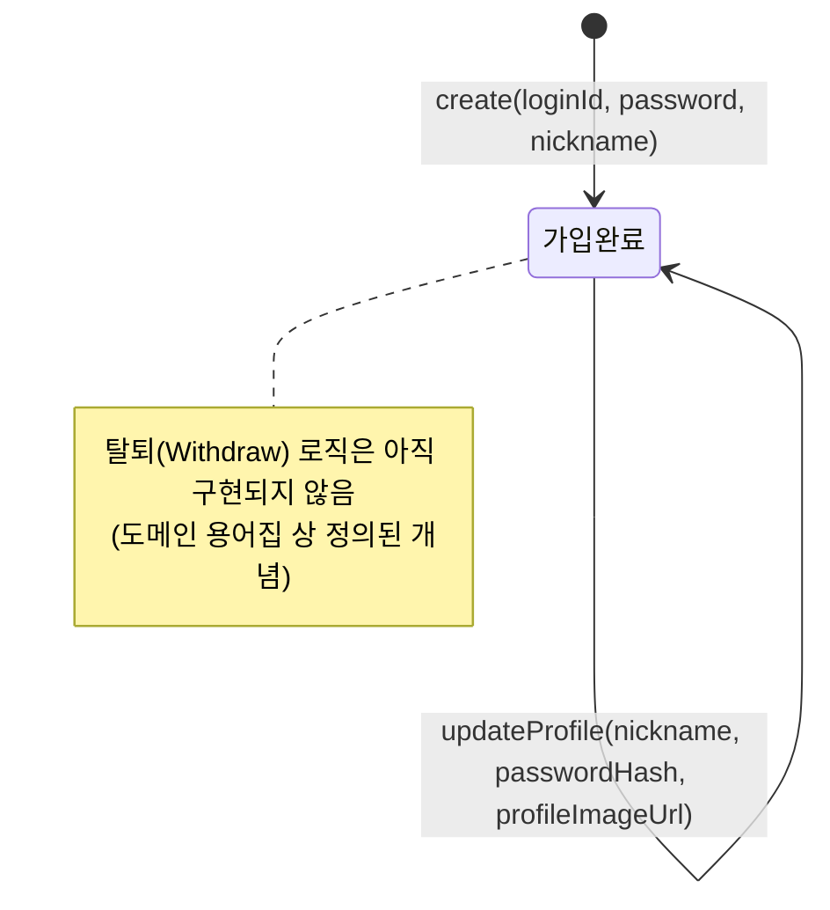

### 상태 전이 설명

- 회원가입(`create`)을 통해 회원은 **가입완료** 상태로 생성된다.
- 닉네임/비밀번호/프로필이미지 중 하나 이상을 변경하는 프로필 수정(`updateProfile`)이 성공하면 **가입완료** 상태를 유지한 채 `updatedAt`만 갱신된다.
- 탈퇴(Withdraw) 시 별도 상태로 전이되는 로직은 아직 구현되지 않았다.

### 불변식

- `loginId`, `nickname`은 각각 전체 회원 중 유일하다.
- `password`는 어떤 경로로도 평문으로 저장되지 않고 BCrypt 해시로만 저장된다.
- `joinedAt`은 최초 생성 이후 변경되지 않는다.
- `updateProfile`은 각 필드가 `null`이 아닌 경우에만 갱신하는 부분 업데이트이므로, 명시적으로 전달되지 않은 필드는 항상 이전 값을 유지한다.

---

## 2. Point (포인트)

회원의 입찰 한도(Bid Limit) 재원이 되는 가상 포인트 계좌.

### 속성

| 속성명 | 타입 | 제약조건 | 설명 |
| --- | --- | --- | --- |
| pointId | Long | PK, Identity | 포인트 계좌 식별자 |
| memberId | Long | Unique, Not Null | 소유 회원 식별자 (FK, 연관관계 매핑 아님) |
| balance | long | Not Null | 보유 잔액 |

### 상태 다이어그램

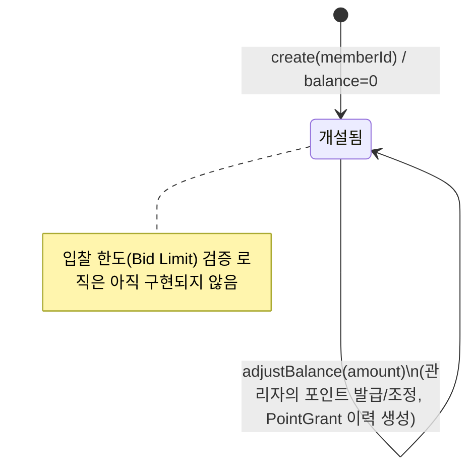

### 상태 전이 설명

- 회원 가입 시 해당 회원의 Point 계좌가 잔액 0인 **개설됨** 상태로 함께 생성된다.
- 관리자가 백오피스에서 포인트를 발급/조정(`adjustBalance`)하면 **개설됨** 상태를 유지한 채 `balance`가 변경되고, [PointGrant](#12-pointgrant-포인트-발급-이력) 이력이 함께 생성된다.

### 불변식

- 하나의 `memberId`는 최대 하나의 Point 계좌만 가진다(`memberId` unique).
- `adjustBalance(amount)` 호출 결과 `balance`가 음수가 되면 `POINT_BALANCE_INSUFFICIENT` 예외가 발생하고 잔액은 변경되지 않는다(음수가 될 수 없다는 설계 의도를 강제).

---

## 3. Card (카드)

거래 대상이 되는 단일 TCG 카드 원본 정보. 소프트 삭제(soft delete)를 적용한다.

### 속성

| 속성명 | 타입 | 제약조건 | 설명 |
| --- | --- | --- | --- |
| cardId | Long | PK, Identity | 카드 식별자 |
| deleted | boolean | Not Null | 소프트 삭제 플래그(`is_deleted`) |
| cardName | String | Not Null | 카드명 |
| cardNumber | String | Not Null | 카드 번호 |
| setName | String | Not Null | 카드 세트명 |
| language | Language(Enum) | Not Null | 카드 언어: `ENGLISH`, `JAPANESE`, `KOREAN` |
| rarity | Rarity(Enum) | Not Null | 카드 희귀도: `MINT` (현재 단일 값) |
| imageUrl | String | Not Null | 카드 이미지 URL |

### 상태 다이어그램

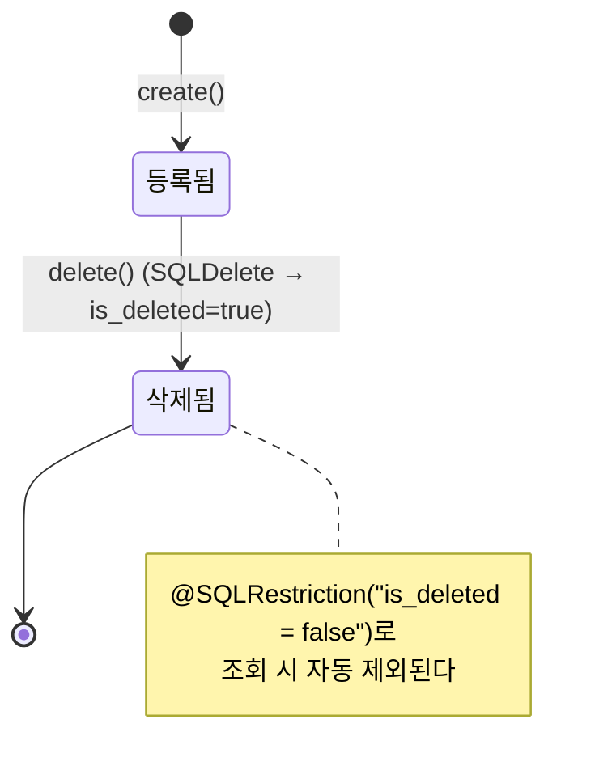

### 상태 전이 설명

- 카드 등록(`create`)을 통해 카드는 **등록됨** 상태로 생성된다.
- 삭제 요청이 발생하면 물리 삭제 대신 `is_deleted=true`로 갱신되어 **삭제됨** 상태로 전이된다(`@SQLDelete`).
- **삭제됨** 상태의 카드는 `@SQLRestriction`에 의해 이후 모든 조회에서 자동으로 제외되며, 다시 **등록됨**으로 되돌아가는 트리거는 없다.

### 불변식

- `cardId`는 생성 이후 변경되지 않는다.
- `cardName`, `cardNumber`, `setName`, `language`, `rarity`, `imageUrl`은 `null`이 될 수 없다.
- `deleted=true`인 카드는 `@SQLRestriction`에 의해 통상적인 조회 경로에서 조회되지 않는다.

---

## 4. Consignment (상품)

셀러가 등록하고 검수를 거치는 카드 매물. 경매 등록 가능 여부를 상태로 관리한다.

### 속성

| 속성명 | 타입 | 제약조건 | 설명 |
| --- | --- | --- | --- |
| consignmentId | Long | PK, Identity | 상품 식별자 |
| card | Card (ManyToOne, Lazy) | Not Null | 대상 카드 |
| sellerMember | Member (ManyToOne, Lazy) | Not Null | 셀러 역할의 회원 |
| majorDefect | String | Nullable | 주요 하자 설명 |
| status | ConsignmentStatus(Enum) | Not Null | 상품 상태 |

**ConsignmentStatus**: `REGISTERABLE`(위탁 등록 완료, 경매 등록 가능) → `AUCTION_SCHEDULED`(경매 등록 완료) → `AUCTION_ONGOING`(경매 진행 중) → `WON`(낙찰) / `PASSED`(유찰, 재등록 가능) / `BLOCKED`(관리자에 의해 차단, 거래 불가)

### 상태 다이어그램

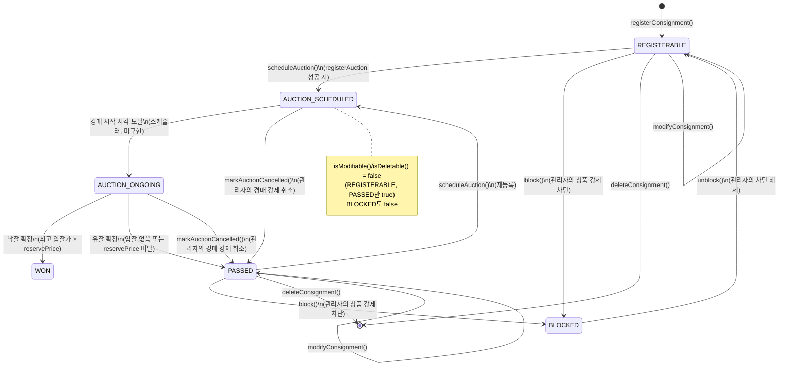

### 상태 전이 설명

- 상품 등록(`registerConsignment`)을 통해 상품은 **REGISTERABLE** 상태로 생성된다.
- **REGISTERABLE** 상태에서 소유 셀러가 경매 등록(`registerAuction` → `scheduleAuction()`)을 요청하면 **AUCTION_SCHEDULED** 상태로 전이된다.
- **PASSED** 상태에서도 소유 셀러가 재경매 등록을 요청하면 동일하게 **AUCTION_SCHEDULED** 상태로 전이된다(재등록).
- **AUCTION_SCHEDULED** 상태에서 경매의 `startedAt` 시각이 도달하면 **AUCTION_ONGOING** 상태로 전이된다(스케줄러 미구현).
- **AUCTION_ONGOING** 상태에서 경매 종료 시각에 최고 입찰가가 `reservePrice` 이상이면 **WON** 상태로 전이된다(낙찰, 미구현).
- **AUCTION_ONGOING** 상태에서 경매 종료 시각에 입찰이 없거나 `reservePrice`에 미달하면 **PASSED** 상태로 전이된다(유찰, 미구현).
- **AUCTION_SCHEDULED**/**AUCTION_ONGOING** 상태에서 관리자가 연결된 경매를 강제 취소(`markAuctionCancelled`)하면 **PASSED** 상태로 전이되어 셀러가 재등록할 수 있다.
- **REGISTERABLE**/**PASSED** 상태에서 관리자가 차단(`block`)을 요청하면 **BLOCKED** 상태로 전이되며, 이후 **REGISTERABLE** 상태로 차단 해제(`unblock`)할 수 있다. 경매가 예정/진행 중인 상품은 먼저 경매를 취소해야 차단할 수 있다.
- **REGISTERABLE**/**PASSED** 상태에서 소유 셀러가 삭제(`deleteConsignment`)를 요청하면 상품이 제거된다.
- **REGISTERABLE**/**PASSED** 상태에서 소유 셀러가 수정(`modifyConsignment`)을 요청하면 같은 상태를 유지한 채 `majorDefect`·검수 정보가 갱신된다.

### 불변식

- `card`, `sellerMember`는 생성 이후 변경되지 않는다(재할당 메서드가 존재하지 않음).
- `isModifiable()`, `isDeletable()`은 항상 `status`가 `REGISTERABLE` 또는 `PASSED`일 때만 `true`를 반환한다(`BLOCKED` 포함 그 외 상태는 `false`).
- `scheduleAuction()`은 호출 시점의 `status`가 `REGISTERABLE`이 아니면 반드시 `CONSIGNMENT_NOT_REGISTERABLE` 예외를 던지고 상태를 변경하지 않는다.
- `markAuctionCancelled()`는 `status`가 `AUCTION_SCHEDULED`/`AUCTION_ONGOING`이 아니면 `AUCTION_NOT_CANCELLABLE` 예외를 던진다.
- `block()`은 `status`가 `REGISTERABLE`/`PASSED`가 아니면 `CONSIGNMENT_NOT_BLOCKABLE`, `unblock()`은 `status`가 `BLOCKED`가 아니면 `CONSIGNMENT_NOT_UNBLOCKABLE` 예외를 던진다.
- 수정·삭제는 `sellerMember`가 요청자 본인인 경우에만 수행되며, 불일치 시 각각 `CONSIGNMENT_MODIFY_OWNER_MISMATCH` / `CONSIGNMENT_DELETE_OWNER_MISMATCH` 예외가 발생한다.
- 하나의 Consignment는 최대 하나의 Certificate, 최대 하나의 Auction과 연결된다(DB 제약이 아닌 `status` 전이 규칙으로 보장됨: `REGISTERABLE`을 벗어나야 새 경매를 만들 수 있다).

---

## 5. ConsignmentImage (상품 이미지)

상품에 첨부되는 이미지 목록. 노출 순서를 가진다.

### 속성

| 속성명 | 타입 | 제약조건 | 설명 |
| --- | --- | --- | --- |
| consignmentImageId | Long | PK, Identity | 이미지 식별자 |
| consignment | Consignment (ManyToOne, Lazy) | Not Null | 소속 상품 |
| imageOrder | int | Not Null | 노출 순서 |
| imageUrl | String | Not Null | 이미지 URL |

### 상태 다이어그램

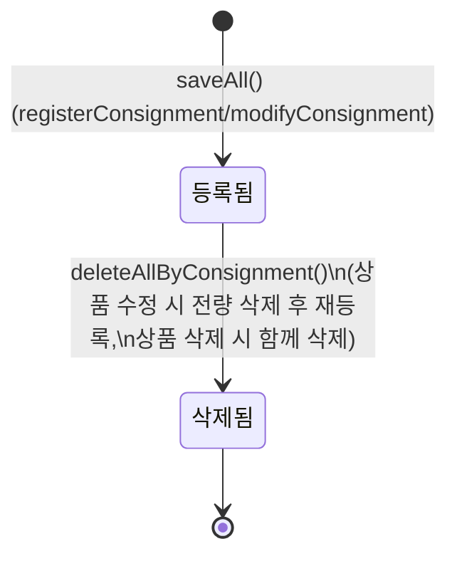

### 상태 전이 설명

- 상품 등록(`registerConsignment`) 시 요청된 이미지 목록이 **등록됨** 상태로 저장된다.
- 상품 수정(`modifyConsignment`) 요청이 들어오면 기존 이미지가 전량 **삭제됨** 상태로 전이된 뒤, 새 이미지 목록이 다시 **등록됨** 상태로 저장된다.
- 상품 삭제(`deleteConsignment`) 요청이 성공하면 연결된 모든 이미지가 **삭제됨** 상태로 전이된다.

### 불변식

- 각 이미지는 정확히 하나의 `consignment`에 속하며, 다른 상품으로 재소속되지 않는다.
- 개별 이미지 단위의 수정은 지원하지 않으므로, 상품 수정 시점 이후에는 항상 "가장 최근에 등록된 이미지 집합"만 유효하다.

---

## 6. Certificate (인증서)

검수(Inspection) 결과로 발급되는 카드 등급 인증서. 상품과 1:1 관계.

### 속성

| 속성명 | 타입 | 제약조건 | 설명 |
| --- | --- | --- | --- |
| certificateId | Long | PK, Identity | 인증서 식별자 |
| serialNumber | String | Unique, Not Null | 인증서 일련번호 |
| consignment | Consignment (OneToOne, Lazy) | Unique, Not Null | 대상 상품 |
| grade | Grade(Enum) | Not Null | 감정 등급 (`GEM_MINT`(10)~`POOR`(1)) |
| certificationBody | CertificationBody(Enum) | Not Null | 검수 기관: `PSA`, `BGS`, `CGC`, `SGC`, `ACE` |
| inspectedAt | LocalDate | Not Null | 검수(감정) 일자 |

### 상태 다이어그램

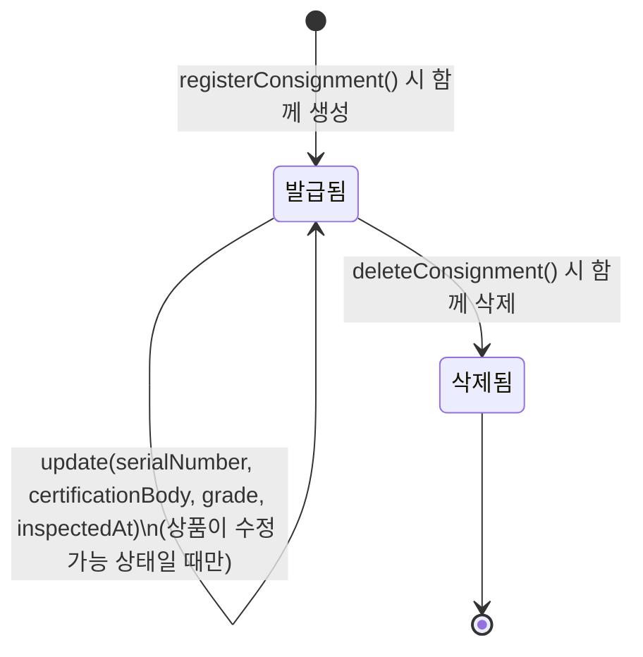

### 상태 전이 설명

- 상품 등록(`registerConsignment`) 시 검수 정보와 함께 인증서가 **발급됨** 상태로 함께 생성된다.
- 상품이 수정 가능(`REGISTERABLE`/`PASSED`) 상태일 때 인증서 수정(`update`) 요청이 성공하면 **발급됨** 상태를 유지한 채 `serialNumber`/`certificationBody`/`grade`/`inspectedAt`이 갱신된다.
- 상품 삭제(`deleteConsignment`) 요청이 성공하면 인증서도 함께 **삭제됨** 상태로 전이된다.

### 불변식

- `consignment`는 unique + not null 제약으로 인해, 하나의 Consignment는 정확히 하나의 Certificate만 가진다(1:1).
- `serialNumber`는 전체 인증서 중 유일하며, 중복 시 저장/수정이 거부된다.
- `getGradeDisplay()`는 항상 `"{certificationBody} {grade.score}"` 형태로 두 필드를 조합해 반환한다.

---

## 7. Auction (경매)

하나의 상품(Consignment)에 대해 정해진 시간 동안 진행되는 실시간 입찰 거래.

### 속성

| 속성명 | 타입 | 제약조건 | 설명 |
| --- | --- | --- | --- |
| auctionId | Long | PK, Identity | 경매 식별자 |
| consignment | Consignment (ManyToOne, Lazy) | Not Null | 대상 상품 |
| winningBidId | Long | Nullable | 낙찰 입찰 ID (Bid FK/연관관계 매핑 전 임시 컬럼) |
| startedAt | LocalDateTime | Not Null | 경매 시작 시각 |
| endedAt | LocalDateTime | Nullable | 경매 종료 시각 |
| auctionStatus | AuctionStatus(Enum) | Not Null | 경매 상태 |
| startingPrice | Long | Not Null | 시작가 |
| reservePrice | Long | Not Null | 리저브(최소 희망 낙찰가, 비공개) |
| bidIncrement | Long | Not Null | 최소 입찰 단위 (시작가의 5%로 자동 계산) |
| winningPrice | Long | Nullable | 낙찰가 |
| createdAt | LocalDateTime | Not Null | 경매 등록 일시 |

**AuctionStatus**: `SCHEDULED`(경매 시작 대기) → `ONGOING`(경매 진행 중) → `WON`(낙찰되어 종료) / `PASSED`(유찰되어 종료) / `CANCELLED`(관리자에 의해 강제 취소되어 종료)

### 상태 다이어그램

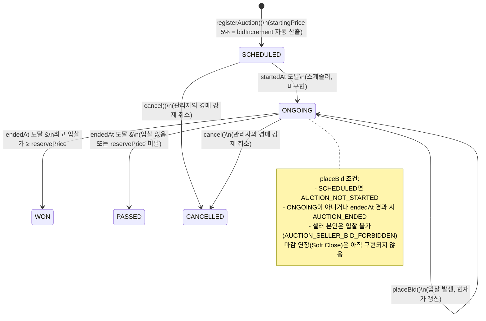

### 상태 전이 설명

- 소유 셀러가 경매 등록(`registerAuction`)을 요청하면 경매는 **SCHEDULED** 상태로 생성된다(`bidIncrement`는 `startingPrice`의 5%로 자동 산출).
- **SCHEDULED** 상태에서 `startedAt` 시각이 도달하면 **ONGOING** 상태로 전이된다(스케줄러 미구현).
- **ONGOING** 상태에서 현재가보다 높은 새로운 입찰(`placeBid`)이 성공하면 **ONGOING** 상태를 유지한 채 현재가(최고 입찰가)만 갱신된다.
- **ONGOING** 상태에서 `endedAt` 시각이 도달하고 최고 입찰가가 `reservePrice` 이상이면 **WON** 상태로 전이된다(미구현).
- **ONGOING** 상태에서 `endedAt` 시각이 도달했지만 입찰이 없거나 `reservePrice`에 미달하면 **PASSED** 상태로 전이된다(미구현).
- **SCHEDULED**/**ONGOING** 상태에서 관리자가 강제 취소(`cancel`)를 요청하면 **CANCELLED** 상태로 전이되며, 연결된 [Consignment](#4-consignment-상품)도 함께 `markAuctionCancelled()`를 통해 **PASSED** 상태로 되돌아간다. 기존 Bid 기록은 그대로 유지되며(포인트 에스크로가 없어 환불 대상이 없음), 취소 사유는 감사 이력 대신 로그로 남긴다.

### 불변식

- `bidIncrement`는 등록 시점에 `startingPrice * 0.05`(반올림)로 계산되어 고정되며, 이후 변경되지 않는다.
- `reservePrice`는 셀러의 비공개(Reserve) 값으로, 일반 응답 DTO에는 노출되지 않지만 관리자용 응답에서는 노출된다.
- `getRemainingSeconds()`는 `auctionStatus`가 `ONGOING`이고 `endedAt`이 존재할 때만 남은 초를 계산하며, 그 외에는 항상 `null`을 반환한다.
- 입찰(`placeBid`)은 `auctionStatus`가 `ONGOING`이고 `endedAt`을 아직 경과하지 않은 경우에만 성립한다.
- `cancel()`은 `auctionStatus`가 `SCHEDULED`/`ONGOING`이 아니면 `AUCTION_NOT_CANCELLABLE` 예외를 던지고 상태를 변경하지 않는다.

---

## 8. Bid (입찰)

회원이 특정 금액으로 구매 의사를 제시하는 행위. 경매당 최고 입찰(`HIGHEST`)은 하나만 존재한다.

### 속성

| 속성명 | 타입 | 제약조건 | 설명 |
| --- | --- | --- | --- |
| bidId | Long | PK, Identity | 입찰 식별자 |
| auction | Auction (ManyToOne, Lazy) | Not Null | 대상 경매 |
| member | Member (ManyToOne, Lazy) | Not Null | 입찰한 회원(Bidder) |
| bidPrice | Long | Not Null | 입찰 금액 |
| bidStatus | BidStatus(Enum) | Not Null | 입찰 상태 |
| createdAt | LocalDateTime | Not Null | 입찰 일시 |

**BidStatus**: `HIGHEST`(현재 최고가) → `OUTBID`(추월당함) / `WON`(낙찰 확정)

### 상태 다이어그램

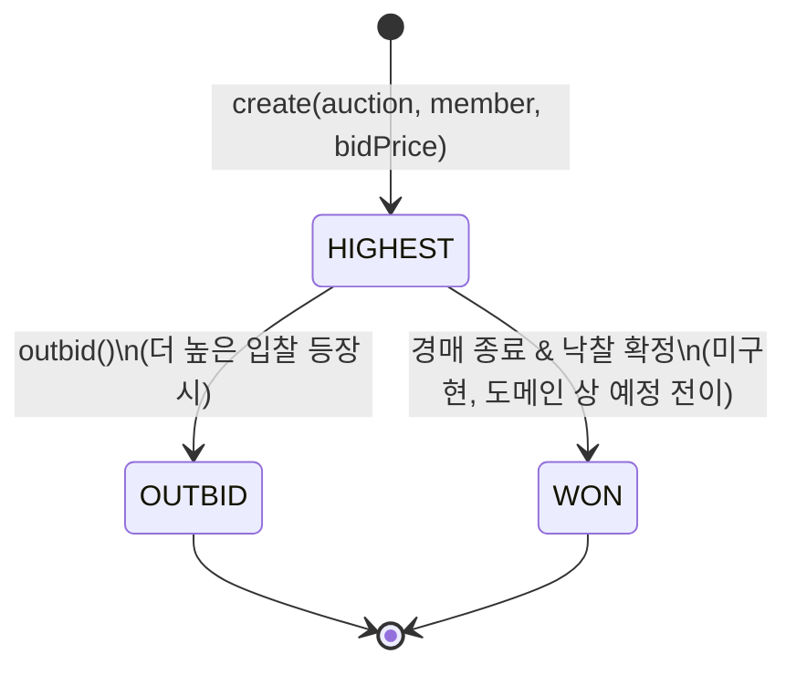

### 상태 전이 설명

- 회원이 입찰(`placeBid`)에 성공하면 새 입찰은 **HIGHEST** 상태로 생성된다.
- 현재가보다 높은 새로운 입찰이 성공하면, 직전까지 **HIGHEST**였던 입찰은 `outbid()` 호출을 통해 **OUTBID** 상태로 전이된다(추월/Outbid).
- 경매가 종료되고 해당 입찰이 낙찰로 확정되면 **HIGHEST** 입찰은 **WON** 상태로 전이된다(미구현, 도메인상 예정된 전이).

### 불변식

- 하나의 `auction`에는 임의 시점에 `bidStatus = HIGHEST`인 Bid가 최대 1개만 존재한다.
- 새 입찰의 `bidPrice`는 현재가보다 높아야 하고(`bidPrice > currentPrice`), 현재가와의 차이가 `bidIncrement` 이상이어야 한다. 위반 시 각각 `OUTBID_EXISTS`, `BELOW_MIN_INCREMENT` 예외가 발생하고 입찰은 생성되지 않는다.
- `bidStatus`가 한 번 `OUTBID`가 되면 다시 `HIGHEST`로 되돌아가지 않는다.

---

## 9. Watch (관심)

회원이 예정/진행 중인 경매를 저장해두는 행위. 회원-경매 조합은 유일하다.

### 속성

| 속성명 | 타입 | 제약조건 | 설명 |
| --- | --- | --- | --- |
| watchId | Long | PK, Identity | 관심 등록 식별자 |
| auction | Auction (ManyToOne, Lazy) | Not Null | 관심 등록된 경매 |
| member | Member (ManyToOne, Lazy) | Not Null | 관심 등록한 회원 |
| createdAt | LocalDateTime | Not Null | 관심 등록 일시 |

제약: `UNIQUE(auction_id, member_id)` — 동일 회원의 동일 경매 중복 관심 등록 방지.

### 상태 다이어그램

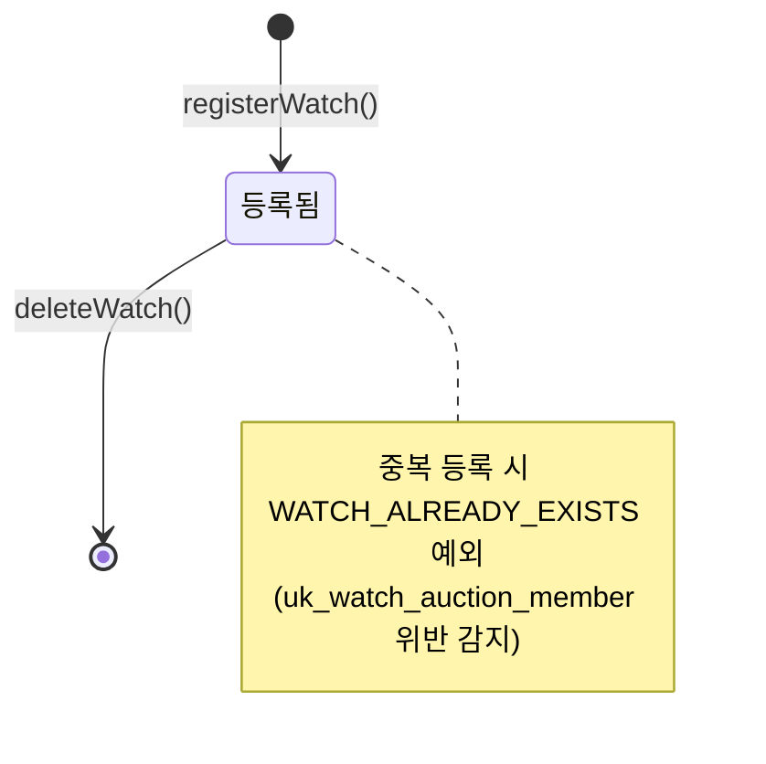

### 상태 전이 설명

- 회원이 관심 등록(`registerWatch`)을 요청하면 해당 (member, auction) 조합이 **등록됨** 상태로 생성된다.
- 이미 관심 등록된 조합에 다시 등록을 요청하면 유니크 제약 위반으로 `WATCH_ALREADY_EXISTS` 예외가 발생하고 상태는 변하지 않는다.
- 회원이 관심 해제(`deleteWatch`)를 요청하면 레코드가 삭제되어 초기 상태로 전이된다.

### 불변식

- `(auction_id, member_id)` 조합은 항상 유일하다(`uk_watch_auction_member`).
- 관심 개수(`watchCount`)는 경매 목록/상세 응답에서 해당 경매의 Watch 레코드 수를 집계한 값과 항상 일치한다.

---

## 10. 값 열거형(Value Enum) 정의

도메인 엔티티의 속성값으로만 쓰이며 별도 생명주기(상태 전이)를 갖지 않는 열거형.

| 열거형 | 소속 | 값 | 설명 |
| --- | --- | --- | --- |
| Language | Card | `ENGLISH`, `JAPANESE`, `KOREAN` | 카드 언어 |
| Rarity | Card | `MINT` | 카드 희귀도 (현재 단일 값) |
| Grade | Certificate | `GEM_MINT`(10) ~ `POOR`(1) | 감정 등급, 점수(score)와 표시명(displayName) 보유 |
| CertificationBody | Certificate | `PSA`, `BGS`, `CGC`, `SGC`, `ACE` | 검수 기관 |

---

## 11. Admin (관리자)

백오피스에 접근해 포인트 발급, 경매/상품 관리를 수행하는 운영 주체. Member와 완전히 분리된 별도 계정 체계를 가지며, 별도의 JWT(`token_type=admin_access`)와 쿠키(`admin-access-token`)로 인증한다.

### 속성

| 속성명 | 타입 | 제약조건 | 설명 |
| --- | --- | --- | --- |
| adminId | Long | PK, Identity | 관리자 식별자 |
| loginId | String | Unique, Not Null | 관리자 로그인 아이디 |
| password | String | Not Null | BCrypt 해시. 평문 저장 금지 |
| name | String | Not Null | 관리자 이름 |
| createdAt | LocalDateTime | Not Null | 계정 생성 일시 |

### 상태 다이어그램

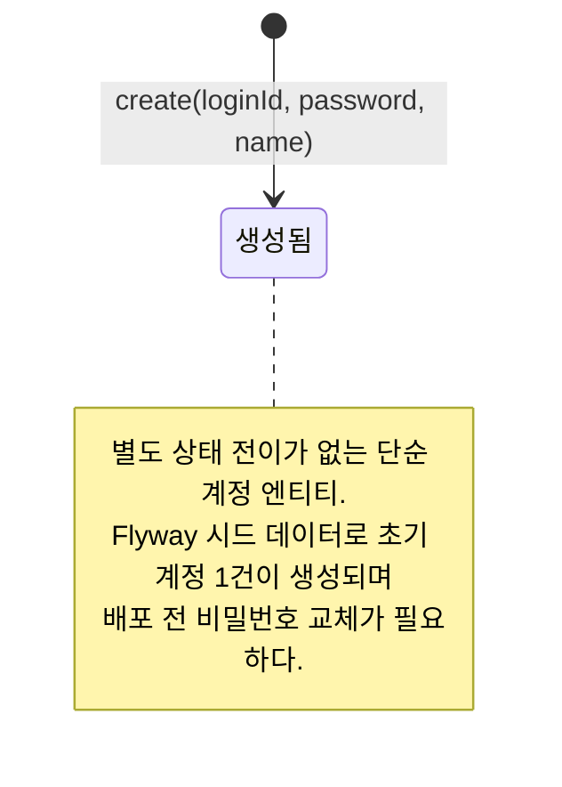

### 불변식

- `loginId`는 전체 관리자 중 유일하다(`uk_admin_login_id`).
- `password`는 어떤 경로로도 평문으로 저장되지 않고 BCrypt 해시로만 저장된다.
- Member 인증(액세스 토큰, 쿠키, 인터셉터)과 완전히 분리되어 있어, Member 토큰으로는 `/admin/**` API를 호출할 수 없고 그 역도 성립하지 않는다.

---

## 12. PointGrant (포인트 발급 이력)

관리자가 회원의 포인트 잔액을 지급하거나 조정한 이력. [Point](#2-point-포인트)의 `adjustBalance` 호출과 함께 항상 1건씩 생성된다.

### 속성

| 속성명 | 타입 | 제약조건 | 설명 |
| --- | --- | --- | --- |
| pointGrantId | Long | PK, Identity | 발급 이력 식별자 |
| memberId | Long | Not Null | 대상 회원 식별자 (FK, 연관관계 매핑 아님) |
| adminId | Long | Not Null | 발급한 관리자 식별자 (FK, 연관관계 매핑 아님) |
| amount | long | Not Null | 조정 금액(양수: 지급, 음수: 차감/정정) |
| reason | String | Nullable | 발급/조정 사유 |
| createdAt | LocalDateTime | Not Null | 발급 일시 |

### 상태 다이어그램

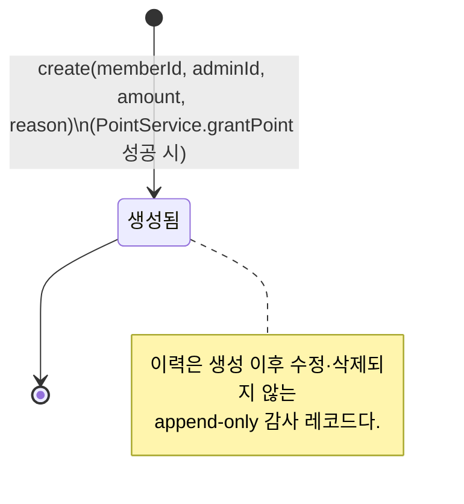

### 불변식

- `amount`가 0이면 발급 자체가 거부되어(`INVALID_POINT_GRANT_AMOUNT`) PointGrant가 생성되지 않는다.
- 하나의 PointGrant는 정확히 하나의 Point 잔액 변경(`adjustBalance`)과 함께 생성되며, 생성 이후에는 수정되지 않는다(append-only).
