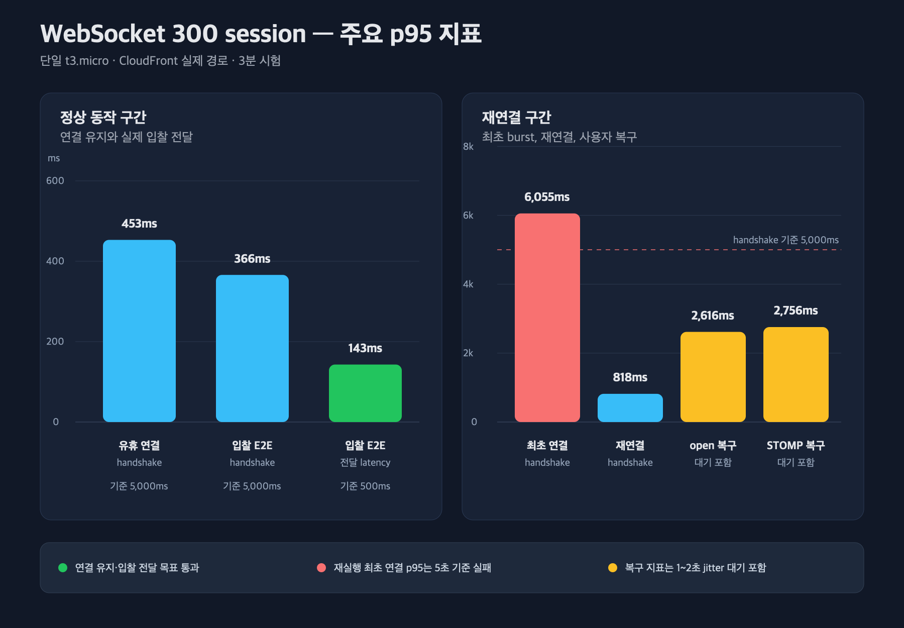
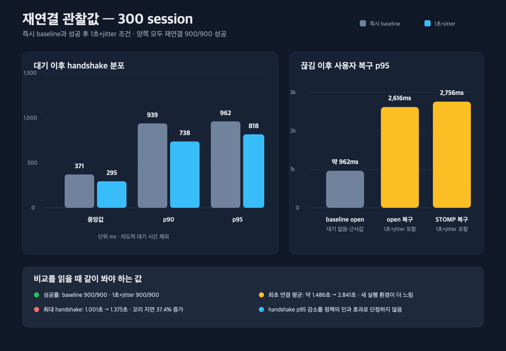

# WebSocket 멀티탭 300 session 부하테스트 결과

## 1. 이 보고서가 검증한 범위

이번 시험은 단일 t3.micro 인스턴스와 실제 CloudFront 경로에서 300개의 WebSocket session을
기준으로 세 가지 질문을 검증했다.

1. 업무 이벤트가 없어도 300개의 연결과 STOMP 구독을 유지할 수 있는가?
2. 한 명의 입찰자가 만든 실제 입찰 이벤트를 300명의 observer에게 제시간에 전달하는가?
3. 300개의 연결이 함께 끊겼을 때 재연결 대기와 jitter가 handshake와 사용자 복구 시간을 어떻게
   바꾸는가?

300은 최대 용량이 아니라 현재 예상 규모의 검증 지점이다. 한 사용자가 여러 탭을 열면 탭마다
별도 WebSocket session이 생기므로, 다중탭이 만든 총 연결 수 300개의 서버 비용은 재현할 수 있다.

다만 k6의 독립 VU 300개는 서버에서 `사용자 100명 × 탭 3개`와 `사용자 300명 × 탭 1개`가
똑같이 보인다. 이번 시험은 300 session의 비용을 측정했을 뿐, 실제 중복 탭 비율이나
SharedWorker가 줄일 수 있는 연결 수는 측정하지 않았다.

## 2. 실험 조건과 판정 기준

### 2.1 공통 조건

| 항목 | 조건 |
| --- | --- |
| 애플리케이션 | 단일 t3.micro 인스턴스 |
| 요청 경로 | GitHub Actions runner → CloudFront → 애플리케이션 |
| 대상 경매 | 346 |
| observer | 최대 300 VU |
| bidder | 1 VU |
| 입찰 간격 | 이전 응답 완료 후 1초를 기다리는 closed-loop |
| 입찰 가격 | 서버의 다음 최소 입찰가부터 43,000원씩 증가 |
| 연결·입찰 시험 | 60초 ramp-up + 120초 유지 |
| 재연결 시험 | 최초 연결 300회 + session당 재연결 3회 |

입찰자를 한 명으로 제한한 이유는 WebSocket 전달과 입찰 동시성 문제를 분리하기 위해서다. 여러
입찰자가 같은 경매 행을 동시에 갱신하면 비관적 잠금 대기와 입찰 거절이 결과에 섞인다. 이번
시험에서는 입찰 생성률을 낮게 고정하고 observer 수만 늘려 DB commit 이후 전달 경로를 관찰했다.

### 2.2 사전에 정한 client 기준

| 경계 | 기준 |
| --- | --- |
| WebSocket open·STOMP CONNECTED | 목표 session의 99.9% 이상 |
| 연결 실패·중복·역순 | 0건 |
| WebSocket handshake | p95 5초 미만 |
| 입찰 이벤트 전달 | p95 500ms 미만, p99 1초 미만 |
| 재연결 | 900회 중 99.9% 이상 성공 |

평균이 아니라 p95와 p99를 본 이유는 일부 사용자의 긴 지연을 평균이 숨길 수 있기 때문이다.
실시간 경매에서는 대부분이 빠르더라도 일부 client가 수초 늦게 현재가를 보는 상황이 문제다.

### 2.3 실행과 원본 결과

- 즉시 재연결 baseline: [run 31495174743](https://github.com/softeerbootcamp-8th/WEB-Team5-55TD/actions/runs/31495174743), [artifact 9103244029](https://github.com/softeerbootcamp-8th/WEB-Team5-55TD/actions/runs/31495174743/artifacts/9103244029)
- production 동작 일치 재연결: [run 31549490949](https://github.com/softeerbootcamp-8th/WEB-Team5-55TD/actions/runs/31549490949), [artifact 9124066811](https://github.com/softeerbootcamp-8th/WEB-Team5-55TD/actions/runs/31549490949/artifacts/9124066811)
- [baseline 원본](./websocket-capacity-retest-f75b04a/reconnect-before-300.json)
- [재실행 원본](./websocket-capacity-retest-3973747/)

두 재연결 실행 모두 앞에서 `유휴 연결 → 60초 회수 → 입찰 E2E → 60초 회수`를 수행했다. 이전
예비 실행 [run 31503579319](https://github.com/softeerbootcamp-8th/WEB-Team5-55TD/actions/runs/31503579319)은
이 선행 부하를 삭제한 채 재연결만 실행했고, 연결 성공 후에도 1초·2초·4초 대기를 누적했다.
baseline과 실행 상태도 다르고 frontend lifecycle과도 달랐으므로 정책 비교에서 제외했다.

각 k6 step에는 다음 시나리오와 artifact 업로드를 계속하기 위한 `continue-on-error`가 있다.
따라서 GitHub Actions가 초록색이어도 모든 threshold가 통과했다는 뜻은 아니다. 아래 판정은 JSON과
job log의 개별 threshold를 기준으로 한다.

## 3. 전체 결과

300 session에서 연결 유지와 입찰 전달 목표는 충족했다. 입찰 E2E와 재연결 재실행은 일부 자동화
threshold가 실패했으므로, 성공한 경계와 실패한 경계를 분리해서 판정했다.

| 시나리오 | 핵심 결과 | 엄격한 자동화 판정 | 목적별 판정 |
| --- | --- | --- | --- |
| 유휴 연결 | open·STOMP 300/300, handshake p95 453ms | 통과 | 연결 유지 통과 |
| 입찰 E2E | 입찰 143/143, 전달 p95 143ms·p99 214ms | `ws_errors=197`로 실패 | 전달 목표 통과·전체 조건부 통과 |
| 즉시 재연결 baseline | 최초 300/300, 재연결 900/900, 재연결 p95 962ms | 통과 | 통과 |
| backoff+jitter 재연결 | 최초 300/300, 재연결 900/900, 재연결 p95 818ms | 최초 연결 p95 6.055초로 실패 | 재연결 목표 통과·전체 조건부 통과 |



이 수치는 client가 관찰한 서비스 품질이다. CPU, CPU credit, heap, GC와 file descriptor 여유를
뜻하지 않는다. 서버 자원 지표를 같은 시간축으로 보존하지 못했으므로 최대 용량도 확정하지 않는다.

## 4. 시나리오 1 — 300개의 유휴 연결 유지

### 4.1 목표

유휴 시험은 입찰이 없어도 탭별 연결 자체가 서버와 네트워크 경로에 주는 비용을 확인한다.
WebSocket은 이벤트가 없을 때도 TCP socket, STOMP session·subscription과 heartbeat 상태를
유지하므로 업무 이벤트를 제거하고 연결 경계만 측정했다.

### 4.2 결과

| 지표 | 결과 | 기준 | 판정 |
| --- | ---: | ---: | --- |
| WebSocket open | 300/300 | 99.9% 이상 | 통과 |
| STOMP CONNECTED | 300/300 | 99.9% 이상 | 통과 |
| connection failure | 0건 | 0건 | 통과 |
| socket error | 0건 | 0건 | 통과 |
| handshake 중앙값 | 295ms | 참고값 | - |
| handshake p90 | 334ms | 참고값 | - |
| handshake p95 | 453ms | 5초 미만 | 통과 |
| handshake 최대 | 2.127초 | 참고값 | - |

300개 연결은 모두 WebSocket open과 STOMP CONNECTED까지 완료됐고 3분 동안 오류 없이 유지됐다.
WebSocket upgrade만 성공하고 STOMP 연결이 실패하면 경매 topic을 구독할 수 없으므로 두 counter를
따로 확인했다.

k6의 `완료된 iteration이 없다`는 경고는 이 시나리오의 실패가 아니다. socket을 끝까지 열어두는
것이 목적이므로 iteration 수가 아니라 open·CONNECTED counter와 오류를 성공 기준으로 사용했다.

### 4.3 해석

이번 결과는 총 300개의 탭별 연결이 짧은 관찰 구간에서 client 연결 실패나 p95 지연을 만들지
않았다는 근거다. 하지만 “같은 사용자의 여러 탭”을 직접 재현한 결과는 아니다. 또한 연결 유지
시간은 3분이고 FD·heap과 CPU credit을 측정하지 않았으므로 장기 안전 용량까지 증명하지 않았다.

## 5. 시나리오 2 — 실제 입찰부터 WebSocket 수신까지

### 5.1 목표

입찰 E2E 시험은 REST 입찰이 DB commit, `AFTER_COMMIT` listener, Redis, Simple Broker와
WebSocket을 거쳐 observer에게 도착하는 전체 경로를 확인한다. 입찰자는 한 명, observer는
300명으로 두어 DB lock 경쟁보다 메시지 전파 경로에 집중했다.

### 5.2 결과

| 구분 | 지표 | 결과 | 기준 | 판정 |
| --- | --- | ---: | ---: | --- |
| 연결 | WebSocket open | 300/300 | 99.9% 이상 | 통과 |
| 연결 | STOMP CONNECTED | 300/300 | 99.9% 이상 | 통과 |
| 연결 | handshake p95 | 366ms | 5초 미만 | 통과 |
| 입찰 | HTTP 성공 | 143/143 | 100% | 통과 |
| 전달 | 수신 이벤트 | 36,355건 | 기대 집합 없음 | 유실률 계산 불가 |
| 전달 | latency 중앙값 | 102ms | 참고값 | - |
| 전달 | latency p95 | 143ms | 500ms 미만 | 통과 |
| 전달 | latency p99 | 214.46ms | 1초 미만 | 통과 |
| 전달 | latency 최대 | 980ms | 참고값 | - |
| 정합성 | 중복 이벤트 | 0건 | 0건 | 통과 |
| 정합성 | 역순 이벤트 | 0건 | 0건 | 통과 |
| 종료 | socket error | 197건 | 0건 | 엄격 기준 실패·원인 분리 필요 |

입찰과 전달 목표는 충족했지만 자동화 threshold는 `ws_errors=197` 때문에 실패했다. 판정은 다음처럼
나눴다.

```text
엄격한 자동화 threshold : 실패
입찰 요청                : 통과
WebSocket 전달 목표      : 통과
입찰 E2E 전체            : 조건부 통과
```

### 5.3 종료 구간 오류를 성공으로 바꾸지 않았다

`ws_errors=197`은 시나리오 종료 과정과 겹쳤다. 전체 WebSocket session 생성 수는 정확히 300이고,
observer 197개가 종료되면서 iteration을 완료했으며 나머지는 graceful 종료 시간 안에 끝나지 않아
interrupted 처리됐다. 시험 중 오류로 재접속이 반복됐다면 session 누적값이 300을 넘어야 하지만
그런 흔적은 없다.

계획된 종료 중 발생했을 가능성이 높지만 현재 스크립트는 close code, close reason과 오류 시각을
보존하지 않는다. 따라서 정상 종료라고 단정하거나 threshold를 사후에 완화하지 않았다. 다음
시험에서는 계획된 close와 transport error를 별도 metric으로 기록해야 한다.

### 5.4 수신 개수만으로 유실률을 계산하지 않았다

`143건 × 300명`을 기대 수신량으로 사용하면 정상 메시지도 유실로 오판한다. observer는 첫 60초
동안 0명에서 300명으로 증가했고 구독 전에 발생한 이벤트는 받을 수 없기 때문이다.

정확한 유실률을 계산하려면 서버가 발행한 eventId, observer별 구독 완료 시각, 발행 시점의 활성
subscription과 observer별 수신 eventId를 함께 기록해야 한다. 이번 시험은 전달 지연, 중복과
관찰된 역순을 측정했지만 실제 유실률은 측정하지 못했다.

### 5.5 eventId와 bidId가 말해주는 범위

`eventId`는 논리 사건을 만들 때 UUID로 한 번 생성한다. 같은 사건이 Redis와 WebSocket을 지나거나
재전달될 때 UUID를 새로 만들지 않고 유지하므로 client가 이미 본 UUID를 다시 받으면 중복으로
판단할 수 있다. UUID 값의 크기로 사건의 순서를 비교할 수는 없다.

`bidId`는 같은 경매에서 늦게 도착한 과거 입찰을 거르는 데 쓸 수 있다. 하지만 전체 bid 테이블이
공유하는 식별자이므로 번호 간격으로 특정 경매의 이벤트 유실을 판단할 수 없다. 마지막 이벤트가
유실되고 이후 메시지가 없다면 비교할 다음 번호도 오지 않는다. 현재 구조에서는 eventId로 중복을
막고, bidId로 역순 적용을 막으며, polling으로 마지막 유실까지 DB snapshot과 다시 맞춘다.

## 6. 시나리오 3 — 즉시 재연결과 production 동작 일치 조건

### 6.1 예비 비교를 폐기하고 선행 부하를 복원했다

첫 적용 후 실행은 baseline과 같은 시험이 아니었다. baseline 앞에는 유휴 연결과 입찰 E2E가
있었지만 적용 후에는 재연결만 단독 실행했다. 정책이 닿지 않는 최초 연결부터 평균이 약 1.5초와
8.7초로 크게 달랐기 때문에, 당시 재연결 p95 감소를 정책 효과로 귀속할 수 없었다.

또한 실제 frontend는 연결에 성공하면 `reconnectAttempt`를 0으로 초기화한다. 정상 endpoint에
세 번 모두 성공하는 이번 시나리오에서는 매번 1초+jitter부터 다시 시작해야 한다. 예비 스크립트는
성공 뒤에도 1초·2초·4초를 누적했으므로 production 동작과 달랐다.

두 문제를 다음처럼 수정하고 다시 실행했다.

- baseline과 같은 유휴 연결·입찰 E2E·회수 순서를 복원했다.
- 성공 뒤 attempt를 초기화해 세 번 모두 1~2초 범위에서 재연결했다.
- handshake와 별도로 `끊김→WebSocket open`, `끊김→STOMP CONNECTED`를 직접 측정했다.

### 6.2 재연결은 모두 성공했지만 전체 자동화는 실패했다

| 지표 | 즉시 baseline | backoff+jitter | 판정 |
| --- | ---: | ---: | --- |
| 최초 WebSocket open | 300/300 | 300/300 | 양쪽 통과 |
| 재연결 WebSocket open | 900/900 | 900/900 | 양쪽 통과 |
| 전체 STOMP CONNECTED | 1,200/1,200 | 1,200/1,200 | 양쪽 통과 |
| 재연결 실패 | 0건 | 0건 | 양쪽 통과 |
| 최초 연결 handshake p95 | 별도 custom 지표 없음 | 6.055초 | 적용 후 기준 실패 |
| 재연결 handshake p95 | 962ms | 818ms | 양쪽 통과 |

backoff+jitter 실행의 재연결 900회는 전부 성공했고 재연결 handshake도 기준 안에 들어왔다. 그러나
최초 300개 동시 연결 p95가 5초 기준을 넘었으므로 전체 자동화 결과는 실패다. 이를 재연결 성공과
섞어 통과로 바꾸지 않았다.

### 6.3 실행 조건을 맞췄어도 정책 효과를 단정하지 않았다

새 실행은 baseline과 같은 선행 부하를 거쳤지만 서로 다른 시각의 운영 실행이라는 한계는 남는다.
정책이 적용되지 않는 최초 연결의 평균을 비교하면 baseline은 약 1.486초, 새 실행은 2.841초로
새 실행이 약 1.9배 느렸다.

baseline의 최초 연결 평균은 k6 전체 `ws_connecting` 1,200건에서 custom 재연결 900건을 뺀
근사값이다. 두 metric의 측정 경계가 조금 달라 정확한 A/B 대조군은 아니다. 전체 연결이 섞인
`ws_connecting` p95도 baseline 2.412초에서 새 실행 6.018초로 증가했다.

따라서 재연결 handshake p95가 962ms에서 818ms로 15.0% 낮아졌다는 사실은 기록하되,
backoff+jitter의 인과 효과라고 단정하지 않는다. 선행 workload 차이는 제거했지만 실행 시각의
네트워크·CloudFront·서버 상태 차이까지 제거하지는 못했다.

### 6.4 사용자가 체감하는 복구는 더 늦어졌다

handshake는 의도적인 대기 시간이 끝난 뒤 WebSocket을 여는 시간만 측정한다. 사용자가 다시
경매 이벤트를 받을 수 있는 시간은 대기까지 포함한 복구 시간이다.

| 지표 | 즉시 baseline | backoff+jitter | 해석 |
| --- | ---: | ---: | --- |
| 재연결 handshake 중앙값 | 371ms | 295ms | 서버 연결 구간 |
| 재연결 handshake p90 | 939ms | 738ms | 서버 연결 구간 |
| 재연결 handshake p95 | 962ms | 818ms | 서버 연결 구간 |
| 재연결 handshake 최대 | 1.001초 | 1.375초 | 새 실행의 꼬리 37.4% 증가 |
| 끊김→WebSocket open p95 | 약 962ms¹ | 2.616초 | 1~2초 대기 포함 |
| 끊김→STOMP CONNECTED p95 | 미측정 | 2.756초 | 구독 요청 직전까지 |

¹ baseline은 대기 없이 즉시 연결하므로 custom handshake p95를 open 복구의 근사값으로 사용했다.



이 결과에서 중요한 트레이드오프는 시험 전체 iteration이 몇 초 늘었는지가 아니다. 1~2초 대기를
넣었기 때문에 전체 실행 시간이 늘어나는 것은 산술적으로 정해져 있다. 실제 비용은 사용자가 다시
WebSocket을 열기까지 p95 2.616초, STOMP CONNECTED까지 p95 2.756초가 걸렸다는 점이다.

최대 handshake도 1.001초에서 1.375초로 증가했다. 없던 꼬리가 생기거나 악화된 결과를 “긴 꼬리가
남았다”라고 완화하지 않았다.

### 6.5 이번 정상 endpoint 시험은 지수 증가 구간을 검증하지 않았다

세 재연결은 모두 첫 시도에 성공했다. frontend는 성공할 때 attempt를 초기화하므로 매번
1초+jitter만 사용했고 2초·4초 단계는 발생하지 않았다. 따라서 이번 결과는 성공 후 재연결 지연과
jitter를 검증했지만, 연속 실패 때 지수 backoff가 요청률을 얼마나 줄이는지는 검증하지 않았다.

이를 검증하려면 일정 시간 handshake를 실패시키는 통제된 장애 구간과 초당 재시도 수 시계열이
필요하다. 현재 summary의 전체 평균 요청률만으로 peak 감소율을 만들지 않는다.

## 7. 가설과 비교한 판정

| 가설 | 결과 | 판정 |
| --- | --- | --- |
| 300개의 유휴 연결을 p95 5초 안에 열고 유지할 수 있다 | 300/300, p95 453ms, 오류 0건 | 지지 |
| 실제 입찰 이벤트를 300 observer에게 p95 500ms 안에 전달한다 | p95 143ms, p99 214ms | 지지 |
| 수신 표본에서 중복·역순이 발생하지 않는다 | 중복 0건, 역순 0건 | 지지 |
| 이번 시험으로 실제 이벤트 유실률을 계산할 수 있다 | observer별 기대 eventId 집합 없음 | 검증 불가 |
| 300개 session의 재연결은 정상 endpoint에서 성공한다 | baseline·적용 후 모두 900/900 | 지지 |
| backoff+jitter가 재연결 성공률을 높인다 | 양쪽 모두 100% | 지지되지 않음 |
| backoff+jitter가 handshake p95를 낮춘다 | 962ms → 818ms, 최초 연결 상태 차이 존재 | 인과 검증 불가 |
| backoff+jitter는 사용자 복구 지연을 늘린다 | open p95 2.616초, STOMP p95 2.756초 | 관찰됨 |
| 이번 시험으로 연속 실패의 지수 backoff를 검증한다 | 모든 재연결이 첫 시도 성공 | 검증 불가 |

## 8. 설계 결정과 다음 검증

300 session에서는 탭별 독립 WebSocket 구조를 유지한다. 이 규모에서 연결 유지와 메시지 전달의
client 목표가 충족됐고, SharedWorker의 lifecycle·인증 동기화 복잡도를 감수할 병목은 관찰되지
않았기 때문이다. 단, 이번 시험은 사용자와 탭의 관계를 구분하지 못했으므로 실제 중복 탭 비율을
별도로 수집해야 한다.

재연결에는 backoff와 jitter를 유지한다. 이번 시험이 성능 개선을 증명했기 때문이 아니라, 장기
장애에서 모든 client가 같은 주기로 서버를 두드리는 것을 피하기 위한 안전장치이기 때문이다.
정상 endpoint에서는 성공률이 이미 100%였고, 사용자가 다시 구독할 때까지의 p95는 2.756초로
늘어나는 비용도 확인했다.

다음 시험에서는 다음 빈칸을 채운다.

1. 통제된 장애 구간을 만들어 연속 실패 시 1초·2초·4초 지수 증가를 재현한다.
2. 초당 재연결 시도 수를 시계열로 저장해 burst peak를 직접 비교한다.
3. 같은 조건을 교차 순서로 여러 번 반복해 실행 시각에 따른 편차를 분리한다.
4. CPU, CPU credit, heap, GC, network와 file descriptor를 artifact와 같은 시간축으로 보존한다.
5. 연결을 30분 이상 유지한 뒤 종료해 session·FD가 기준선으로 돌아오는지 확인한다.
6. 계획된 close와 transport error를 분리하고 close code·reason·시각을 보존한다.
7. server eventId와 observer별 구독 구간을 연결해 실제 유실률을 계산한다.
8. privacy-safe client 식별자와 tab heartbeat로 사용자별 탭 수 분포, 동일 경매 중복 구독률과
   SharedWorker 도입 시 줄어드는 예상 session 수를 측정한다.

## 9. 말할 수 있는 것과 없는 것

이번 시험으로 말할 수 있는 범위는 다음과 같다.

> 이번 코드와 CloudFront 경로의 3분 시험에서 단일 t3.micro는 300개의 WebSocket session을
> 연결했고, 실제 입찰 143건을 모두 처리해 이벤트를 p95 143ms로 전달했다. 수신 표본의 중복과
> 역순은 0건이었다. 재연결은 baseline과 backoff+jitter 조건에서 모두 900/900 성공했다.
> backoff+jitter 조건에서 사용자가 다시 STOMP CONNECTED에 도달한 p95는 2.756초였다.

반대로 다음 결론은 내리지 않는다.

- t3.micro는 어떤 환경에서도 WebSocket 300개까지 안전하다.
- 300 session이 서버의 최대 용량이다.
- 300 VU가 실제 사용자 100명의 3개 탭을 직접 재현했다.
- 중복과 역순이 0건이므로 이벤트 유실도 0건이다.
- 재연결 handshake p95가 낮아진 원인이 backoff+jitter다.
- backoff+jitter가 재접속 peak를 특정 비율만큼 줄였다.
- workflow가 성공했으므로 모든 threshold가 통과했다.

이번 결과는 현재 설계를 유지할 검증 지점과 다시 설계를 검토할 조건을 만들었다. 최대 용량과
단일 병목 위치, SharedWorker의 실제 절감 효과는 후속 운영 지표와 반복 시험이 있어야 판단할 수
있다.
