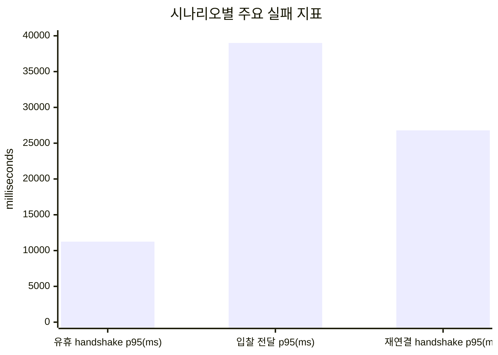
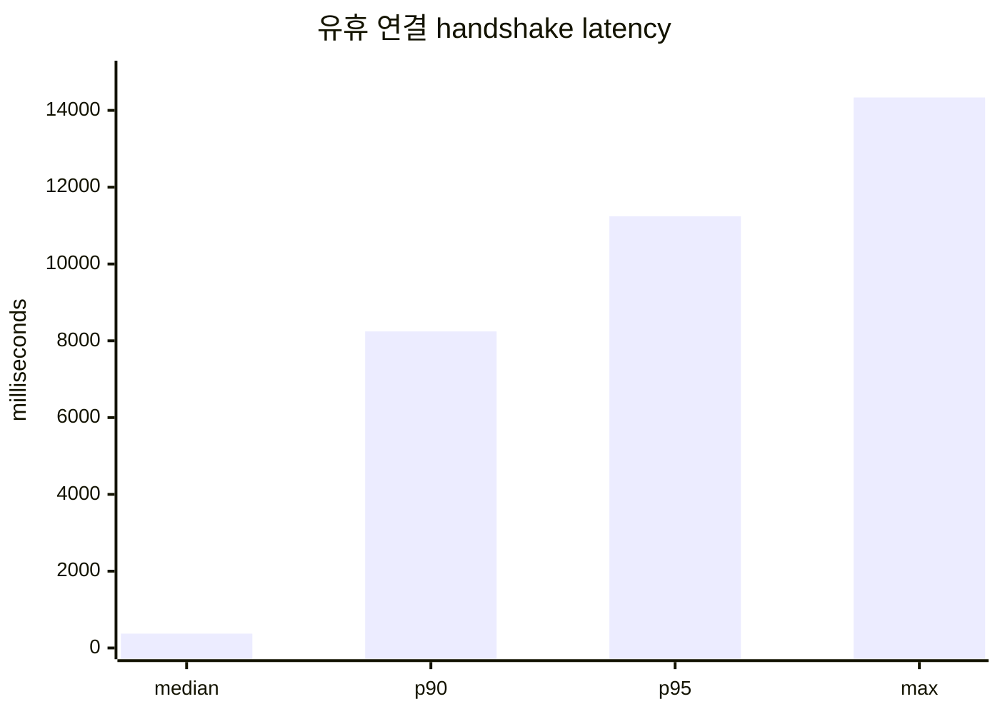
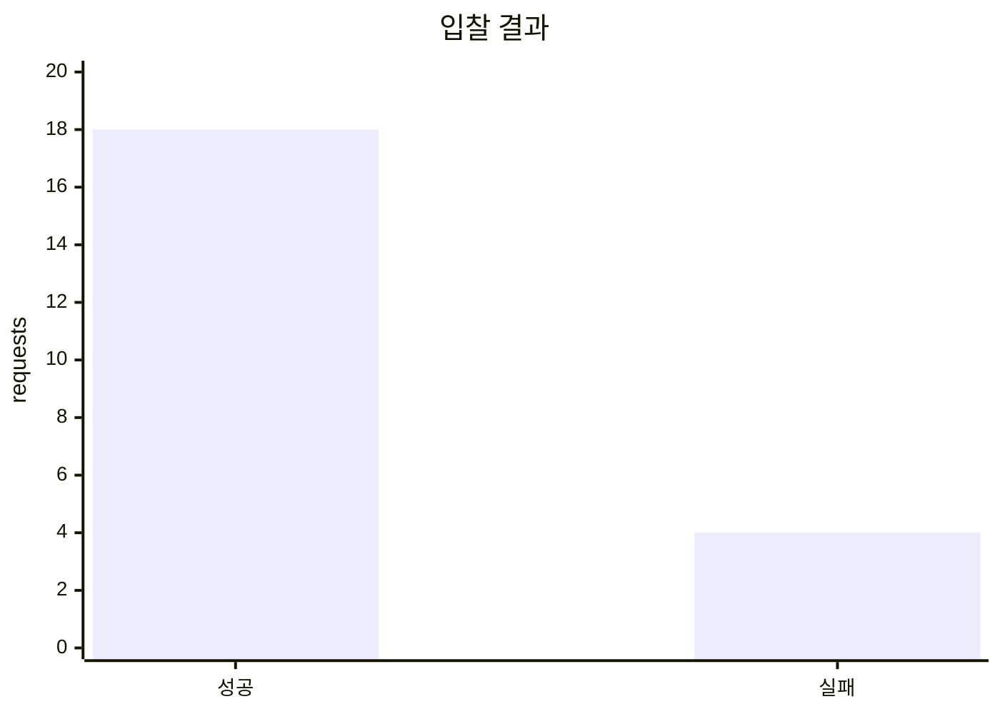
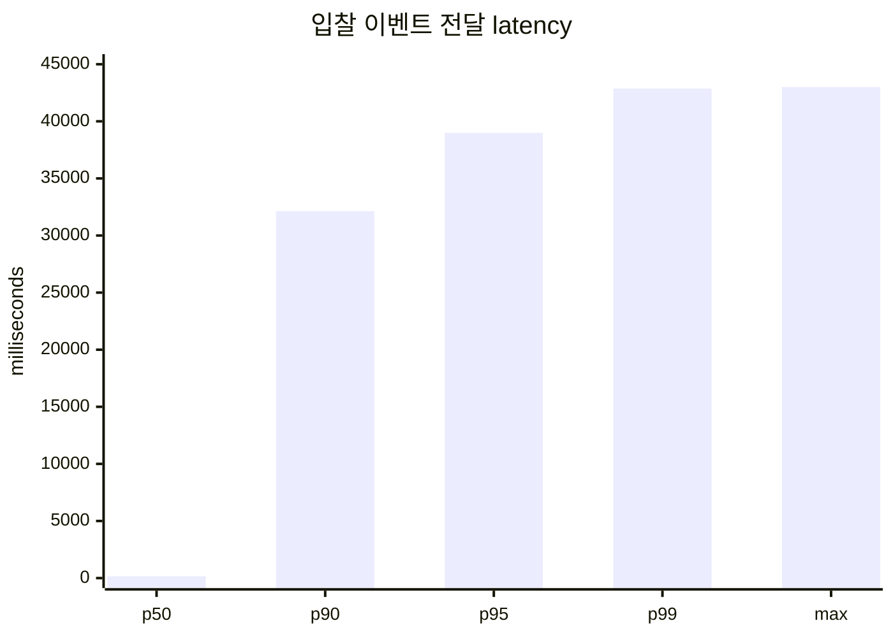
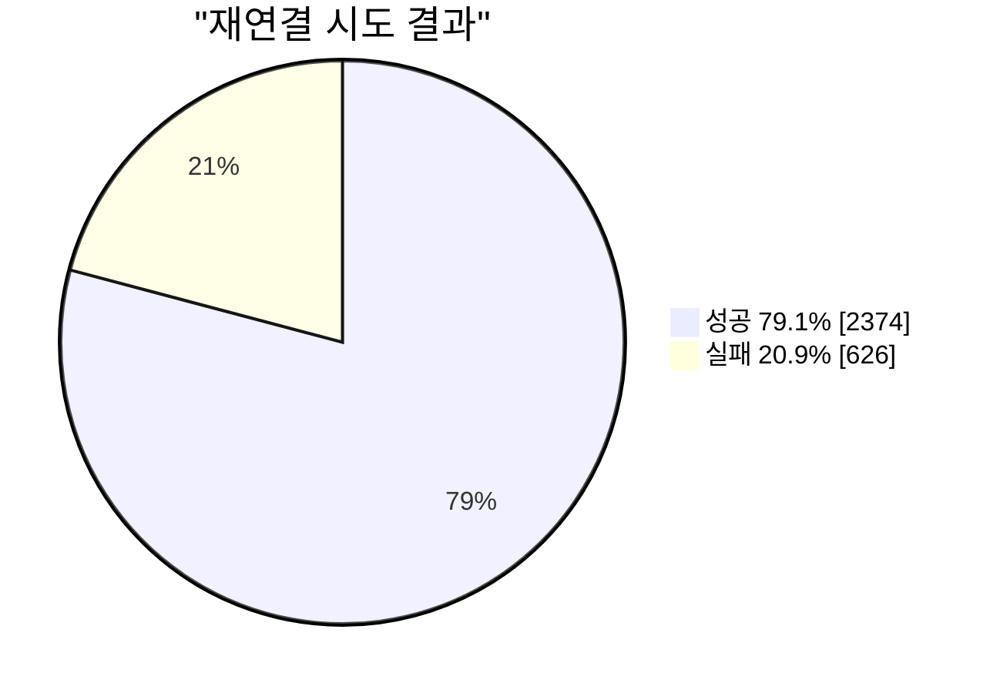

# WebSocket 멀티탭 용량 재시험 결과

## 1. 결론

이번 재시험은 세 시나리오 모두 1,000 단계에서 threshold를 위반해 2,000~5,000 단계로 진행하지
못했다. 따라서 현재 환경의 안전 용량을 “1,000 session”으로 확정할 수 없다.

다만 다중탭 session 증가가 단순한 연결 개수 문제가 아니라 다음 세 가지로 나타나는 것은 확인했다.

- 연결 수가 늘면 handshake tail latency가 급격히 증가한다.
- 실제 이벤트가 발생하면 전달 지연과 역순 수신이 함께 증가한다.
- 연결이 한꺼번에 끊기면 초기 연결보다 재연결 handshake 성공률이 크게 낮아진다.

이번 결과만으로 DB, Redis, Simple Broker, CloudFront 중 하나를 단일 원인으로 지목하지 않는다.
이번 실행에는 서버의 CPU, heap, GC, file descriptor와 socket 수가 포함되지 않았기 때문이다.
다음 실행에서는 Datadog·CloudWatch를 같은 시간대에 조회하고, FD·socket 지표가 없으면 SSM 또는
`/proc` snapshot으로 보완한다.

## 2. 실험 질문과 가설

| 질문 | 가설 |
| --- | --- |
| 유휴 session이 늘면 즉시 연결이 실패하는가? | 1,000 session까지 연결은 되지만 handshake tail이 증가할 수 있다. |
| 실제 입찰 이벤트가 여러 탭에 전달되는가? | bidder 1명으로 DB 경쟁을 제거하면 전달 p95 500ms 이내를 유지한다. |
| 이벤트 순서가 유지되는가? | 비동기 발행 경로에서는 역순 도착이 발생할 수 있지만 client가 과거 상태를 적용하지 않아야 한다. |
| 재연결 폭주를 흡수하는가? | backoff와 jitter가 재연결 시점을 분산해 99.9% 이상 복구한다. |

## 3. 실행 조건

- 단일 t3.micro 애플리케이션 인스턴스
- 실제 CloudFront WebSocket endpoint
- k6 실행 시간: 각 시나리오 ramp 60초 + hold 120초
- 시나리오 1·2 단계: 100 → 250 → 500 → 750 → 1,000
- threshold 실패 시 해당 시나리오의 상위 단계 중단
- 입찰 경매: 312
- bidder: 1명
- 입찰 간격: 1초
- 입찰가: 2,800,000원 시작, 5,000원씩 증가

기존 backoff+jitter 결과 원본: [GitHub Actions artifact](https://github.com/softeerbootcamp-8th/WEB-Team5-55TD/actions/runs/31472201927/artifacts/9094306323)

이번 baseline 결과는 `reconnect-before-{target}.json`으로 추가한다. 기존 결과를 덮어쓰지 않는다.

## 4. 전체 결과



| 시나리오 | 실행 단계 | 주요 결과 | threshold |
| --- | ---: | --- | --- |
| 유휴 연결 | 1,000 | open 1,000, STOMP 1,000, handshake p95 11.24초 | 실패 |
| 입찰 E2E | 1,000 | 성공 18, 실패 4, 이벤트 8,164, 역순 485건 | 실패 |
| 재연결 | 1,000 | 재연결 성공 2,374/3,000, 실패 626건 | 실패 |

세 시나리오 모두 1,000 단계에서 중단됐으므로 2,000 이상 결과는 “실패”가 아니라 “미실행”이다.

## 5. 시나리오 1: 유휴 WebSocket 연결

### 측정값

| 지표 | 결과 |
| --- | ---: |
| 목표 VU | 1,000 |
| WebSocket open | 1,000 |
| STOMP CONNECTED | 1,000 |
| connection failure | 0 |
| socket error | 0 |
| handshake 중앙값 | 373ms |
| handshake p90 | 8.24초 |
| handshake p95 | 11.24초 |
| handshake 최대 | 14.34초 |



### 해석

연결과 STOMP 구독 자체는 1,000건 모두 성공했다. 그러나 p95가 11.24초로 기준 5초를 넘었다.
즉, “최종적으로 연결된다”와 “허용 가능한 시간 안에 연결된다”는 다른 문제다. 중앙값 373ms와
p95 11.24초의 차이는 일부 후반 연결에서 긴 tail이 생겼음을 의미한다.

가능한 원인은 t3.micro CPU credit, CloudFront·proxy handshake 처리량, 애플리케이션 accept 처리,
또는 GitHub runner의 socket 생성 속도다. 이번 실행에는 CPU·FD·Tomcat 지표가 없으므로 어느 경계인지
확정할 수 없다.

### 가설 검증

“1,000 session에서 즉시 연결이 실패한다”는 가설은 기각됐다. 반면 “1,000 session이 안전하다”는
결론은 내릴 수 없다. 3분 시험이었고, 종료 후 session·FD·heap 회수도 측정하지 않았기 때문이다.

## 6. 시나리오 2: 실제 입찰 → WebSocket 수신

### 측정값

| 지표 | 결과 |
| --- | ---: |
| 목표 observer VU | 1,000 |
| 입찰 성공 | 18 |
| 입찰 실패 | 4 |
| 입찰 성공률 | 81.8% |
| WebSocket open | 2,240 |
| STOMP CONNECTED | 2,240 |
| connection failure | 205 |
| socket error | 1,725 |
| 이벤트 수신 | 8,164 |
| 중복 이벤트 | 0 |
| 역순 이벤트 | 485 |
| 전달 latency p50 | 151ms |
| 전달 latency p90 | 32.13초 |
| 전달 latency p95 | 38.997초 |
| 전달 latency p99 | 42.872초 |
| 전달 latency 최대 | 43.01초 |
| HTTP 요청 latency p95 | 30.18초 |





### 왜 이 결과가 나왔는가

bidder는 1명으로 제한했기 때문에 이전처럼 두 bidder가 같은 가격을 보내는 동시성 오류는
제거했다. 그런데도 입찰 4건이 실패했고 HTTP p95가 30초를 넘었다. 이는 입찰 요청 자체도
부하 상황에서 지연되거나 timeout됐음을 보여준다. 다만 실패 status별 집계와 DB·Hikari·executor
지표가 없으므로 DB 문제인지 API timeout인지 확정할 수 없다.

또한 `ws_open_success=2,240`, `ws_sessions=2,445`는 목표 1,000개의 동시 session이 아니다.
observer 함수가 socket 종료 후 다시 iteration을 수행하면서 누적 session 시도가 포함됐을
가능성이 있다. 따라서 이 숫자를 “2,445명이 동시에 접속했다”고 해석하지 않는다.

### 순서와 유실 해석

`ws_order_errors=485`는 같은 observer 실행에서 이전에 본 `bidId`보다 낮은 `bidId`가 뒤늦게
도착한 사례다. 이는 비동기 executor·Redis·Broker·outbound 경로가 DB 처리 순서를 그대로 보존하지
않을 수 있다는 초기 우려와 일치한다.

반면 `eventId` 중복은 0건이었다. 그러나 기대한 이벤트 목록과 각 session의 구독 시작 시점을
저장하지 않았으므로 “유실 0건”이라고 말할 수 없다. `bidId`는 과거 상태를 적용하지 않는 최신성
비교자이지, 번호 gap으로 이벤트 유실을 판정하는 sequence가 아니다. 마지막 이벤트가 유실되면
다음 번호가 오지 않으므로 polling이 DB snapshot을 다시 읽어 화면을 교정해야 한다.

### 가설 검증

“1,000 session에서 전달 p95 500ms 이하를 유지한다”는 가설은 기각됐다. 전달 p95가 38.997초로
크게 증가했고 역순도 485건 관찰됐다. 다만 동시 session과 누적 session이 섞였기 때문에 정확한
용량 한계로 해석하기 전에 부하 모델을 먼저 수정해야 한다.

## 7. 시나리오 3: 동시 재연결

기존 결과는 지수 backoff+jitter 적용 후 결과이며, 이번 추가 실험은 적용 전 즉시 재연결 baseline이다.

### 측정값

| 지표 | 결과 |
| --- | ---: |
| 최초 연결 | 1,000/1,000 |
| 재연결 시도 | 3,000 |
| 재연결 성공 | 2,374 |
| 재연결 실패 | 626 |
| 재연결 성공률 | 79.1% |
| STOMP CONNECTED | 3,190/4,000 |
| socket error | 46 |
| 재연결 handshake p95 | 26.79초 |
| `ws_connecting` p95 | 44.84초 |



### 해석

기존 backoff+jitter 적용 결과에서 최초 연결은 1,000건 모두 성공했지만, 공통 시점에 socket을
닫은 뒤 재연결은 79.1%에 그쳤다. 이번 baseline은 대기 없이 즉시 재연결해 재연결 요청 peak가
얼마나 증가하고 성공률·handshake p95가 어떻게 변하는지 비교한다.
이는 초기 연결보다 재연결 handshake가 훨씬 취약하다는 의미다. backoff와 jitter가 있어도 서버·
proxy·부하 생성기가 처리할 수 있는 신규 handshake 처리량을 넘으면 재연결 성공을 보장하지
못한다.

다만 이번 시험은 endpoint 장애나 인스턴스 failover가 아니라 healthy endpoint에 대한 client
socket 종료 시험이다. 따라서 “장애 복구 후 snapshot까지 정상 복구된다”고 해석할 수 없다.

### 가설 검증

기존 결과만으로 “backoff와 jitter가 99.9% 이상 재연결을 보장한다”고 말할 수 없다. baseline과
적용 후 결과를 같은 조건으로 비교해 재연결 성공률보다 신규 handshake peak, p95, 전체 복구
시간이 얼마나 분산되는지 확인한다. handshake 완료, STOMP CONNECTED, SUBSCRIBE, REST snapshot
완료는 별도 지표로 계산한다.

## 8. 다중탭 관점의 종합 해석

이번 시험의 핵심은 “탭이 많으면 연결이 많다”에서 끝나지 않는다. 연결 수가 늘면서 다음 비용이
동시에 증가한다.

```text
탭 증가
→ TCP socket·FD·STOMP session 증가
→ handshake와 heartbeat 증가
→ 이벤트 발생 시 subscription 조회·payload 복제·outbound write 증가
→ 느린 연결과 재접속이 queue·heap·CPU를 압박
```

이번 결과는 유휴 연결에서도 handshake tail이 생기고, 실제 이벤트에서는 전달 지연과 역순이
동시에 증가하며, 재접속에서는 성공률이 더 크게 떨어지는 흐름을 보여준다. 따라서 SharedWorker
도입 여부는 “session 수를 줄이면 좋다”가 아니라, 실제 서버 자원과 사용자 탭 분포를 기준으로
결정해야 한다.

## 9. 개선 우선순위

### P0: 재시험 전 계측 수정

1. idle·bid observer를 VU당 고정 session 하나만 유지하도록 수정한다.
2. 동시 session 수와 누적 session 생성 시도를 별도 metric으로 기록한다.
3. socket open, STOMP CONNECTED, SUBSCRIBE, close를 각각 기록한다.
4. 입찰 실패 status와 error code를 분리한다.
5. publisher의 기대 이벤트 목록을 저장해 누락·중복·역순을 독립 계산한다.

### P1: 서버 병목 확인

1. Datadog에서 WebSocket session, STOMP connect/disconnect, Broker publish, Redis receive,
   outbound error를 같은 실행 ID로 수집한다.
2. CloudWatch에서 CPU, CPU credit, heap·GC, file descriptor, network throughput을 기록한다.
3. Redis receive → Broker publish → client 수신 latency를 같은 시간축으로 비교한다.
4. send buffer와 send time limit 초과 여부를 확인한다.

### P2: 복구와 구조 개선

1. 실제 인스턴스 장애 또는 endpoint 차단을 이용한 failover 시험을 추가한다.
2. 재연결 뒤 STOMP 재구독과 REST snapshot 보정 성공률을 별도로 측정한다.
3. 장기 장애의 30초 backoff 상한에서도 jitter가 유지되는지 확인한다.
4. 1,000 단계가 보완된 계측으로 통과한 뒤에만 2,000 이상으로 확대한다.

## 10. 배운 점

- WebSocket 용량은 사용자 수가 아니라 session 수와 session lifetime으로 측정해야 한다.
- 연결 성공률이 100%여도 handshake p95가 길면 실제 사용자 경험은 실패할 수 있다.
- bidder를 1명으로 제한해도 입찰 API와 WebSocket 경로는 서로 영향을 줄 수 있으므로 HTTP·DB·
  Broker 지표를 함께 봐야 한다.
- `eventId`는 중복 식별자이고, `bidId`는 최신성 비교자다. 둘 다 전역 순서나 마지막 유실 감지기는
  아니다.
- 역순 이벤트를 발견해도 곧바로 “유실”이라고 말할 수 없다. 늦은 도착과 실제 유실은 같은 관측을
  만들 수 있다.
- polling은 마지막 이벤트 유실을 복구하는 현실적인 보정 경로이고, stateVersion은 중간 gap을
  빠르게 감지하는 추가 신호다.
- 부하테스트가 실패했다는 사실보다, 동시 session·누적 session·서버 병목을 분리하지 않으면
  결과를 잘못 해석할 수 있다는 점이 더 중요한 학습이다.
